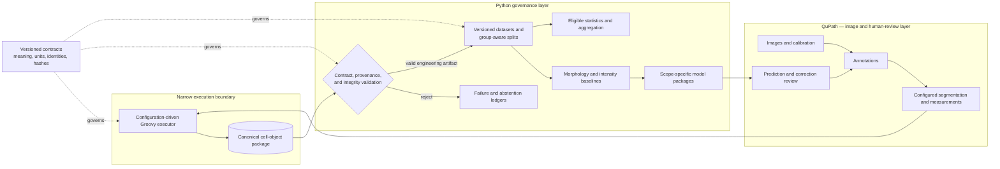

# IFQuant Platform

> **Current development:** native spatial interchange and a real lung intake
> example are in progress. See the [active plan](docs/DEVELOPMENT_PLAN.md),
> [interchange guide](docs/SPATIAL_INTERCHANGE.md) and [saved state](PROGRESS.md).
> The broader documentation refresh is underway; the claims below describe the
> preceding stage 1–6 foundation until the new evidence is finalized.

| Claim | Status | Evidence (artefact path) | Notes |
| --- | --- | --- | --- |
| Core IF contracts, governance, references, splits and evaluation software run on engineering fixtures | Descriptive only | `validation/evidence/stages-1-4-20261009.json` | Existing fluorescence v1 boundaries retained; real-data gates remain open. |
| Native QuPath pilot exported and passed structural checks | Descriptive only | `validation/PHASE1_QC_STATUS.md` | Run 05: 1,803 candidates; 194 accepted topology warnings await H2. |
| StarDist fresh export and deterministic QC succeeded | Descriptive only | `validation/evidence/stages-1-4-20261009.json` | Run 11: 2,380 candidates, 2,308 accepted, 72 excluded; 1,322 accepted topology warnings. |
| High-resolution intake, H&E candidate workflow and specimen/cell reports execute | Descriptive only | `validation/evidence/stages-1-4-20261009.json` | Synthetic TIFF/pyramid checks and a QuPath RGB bridge; no real H&E accuracy or scanner-scale benchmark. |
| Scientific accuracy, injury severity, lineage and backend equivalence | Not established | `docs/STAGES_1_4_STATUS.md` | Independent data, reviewer decisions and endpoint-specific evaluation required. |
| InstanSeg execution and native AnnData/SpatialData adapters | Not established | `docs/STAGES_5_6_PIPELINE.md` | These specific executors/adapters remain planned. |
| Processed spatial RNA, explicit affine region links and genotype/TCR missingness | Descriptive only | `validation/evidence/stages-5-6-20261009.json` | Initial CSV-based engineering increment; native AnnData/SpatialData adapters and public-paper reproduction remain planned. |

IFQuant Platform is a **QuPath-first high-resolution tissue imaging and spatial
phenotyping tool**, with lung injury/regeneration as its first application.
It supports future obtainable images; public and synthetic data are development
resources. A separate H&E module complements the governed fluorescence workflow.
Optional spatial-omics and TME extensions are planned after the imaging core.
The [stage 5–6 pipeline](docs/STAGES_5_6_PIPELINE.md) now defines those extensions;
its first identity, coordinate and processed-molecular increment is implemented.

> **Scientific status:** engineering checks do not approve a detector, endpoint,
> lesion grade or model as biologically valid, equivalent or universal.

Original source is [MIT licensed](LICENSE); [third-party terms](THIRD_PARTY_NOTICES.md)
remain separate. The historical `IFQuant-Lung` repository remains read-only.
The current changes are an engineering implementation of roadmap stages 1–4,
not a scientific release. See [status and remaining gates](docs/STAGES_1_4_STATUS.md).

| If you want… | Read |
| --- | --- |
| Run H&E, correction/review, cell or specimen workflows | [Tissue workflow guide](docs/TISSUE_WORKFLOW.md) |
| Develop spatial RNA and optional multimodal/TME pipelines | [Stage 5–6 plan and initial commands](docs/STAGES_5_6_PIPELINE.md) |
| See implementation evidence and remaining work | [Stage status](docs/STAGES_1_4_STATUS.md), [progress](PROGRESS.md) |
| Review papers and the future omics/TME pipeline | [Methodology roadmap](notes/2026-10-09-development-roadmap.md) |
| Understand governance and backend gates | [Responsibilities](docs/RESPONSIBILITY_BOUNDARIES.md), [StarDist status](docs/PHASE5_STATUS.md) |
| Inspect human decisions and AI contributions | [Development record](DEVELOPMENT.md) |
| Continue development | [Agent context](AI_CONTEXT.md) |

## Try it yourself

From a clean clone, with Python 3.11+ and uv installed; no image download required:

```powershell
uv sync --locked --extra dev --extra imaging
uv run --no-sync python -m ifquant_platform demo-histology --output validation/output/demo
uv run --no-sync python -m ifquant_platform validate-histology validation/output/demo/run
uv run --no-sync python -m ifquant_platform report-specimens validation/output/demo/run --output validation/output/specimen-demo
```

Open `validation/output/demo/run/report.html` and
`validation/output/specimen-demo/report.html`. Use fresh destination names for
subsequent runs. The demo is entirely synthetic and deliberately leaves review
pending. For real-image intake, QuPath export, immutable corrections, marker
thresholds and ordinal forms, follow the [guide](docs/TISSUE_WORKFLOW.md).

## Architecture

The central rule is **meaning is versioned separately from execution**.
Contracts state what an artifact means; QuPath performs configured image work;
the canonical package carries evidence; Python independently validates and
governs every downstream use.



### Responsibility boundaries

| Owner | Responsible for | Explicitly outside its authority |
| --- | --- | --- |
| QuPath UI | Viewing, annotation, segmentation inspection, correction, prediction review | Dataset versions, split assignment, training, statistics |
| `qupath/scripts/` | Deterministic configured execution and canonical export | Hard-coded study paths, model training, hidden endpoint rules |
| `contracts/` | Field meaning, units, identities, canonical form, method binding | Runtime paths, UI state, scientific approval |
| `src/ifquant_platform/` | Canonicalization, validation, hashing, provenance, QC/review rules | Interactive image editing and backend-specific UI behavior |
| `datasets/` | Immutable manifests, lineage, group-aware partitions | Mutable labels, tile-random leakage, model code |
| `ml/` | Training, evaluation, calibration, abstention, portable model packages | Universal-model claims and implicit datasets |
| `validation/` | Engineering fixtures and scientific-evidence plans | Promotion by implication |
| `compat/g_surf/` | Optional frozen compatibility descriptors | Historical authority or new-core dependencies |

The full ownership matrix is in
[Responsibility boundaries](docs/RESPONSIBILITY_BOUNDARIES.md).

## Target process: one governed analysis run

1. Register immutable image bytes, biological-unit identity, channel mapping,
   calibration, acquisition groups, and supplied annotations.
2. Bind a measurement definition, parameter set, backend configuration,
   preprocessing profile, runtime artifacts, and fresh output destination.
3. Run a narrow Groovy executor inside QuPath, scoped to supplied annotations.
4. Export cell/nucleus geometry, calibrated morphology, compartment intensity,
   detector/model identity, QC, review state, and provenance.
5. Validate the complete package independently in Python. Invalid or ambiguous
   packages stop here; downstream code does not repair them silently.
6. Publish reviewed identities, images, annotations, and corrections into a new
   immutable governed observation-set revision.
7. Freeze a reviewed DAPI nuclear-reference revision with an exhaustive region
   ledger, explicit ignore regions, canonical in-image/in-ROI geometry, and
   prediction-exposure/adjudication lineage. Nuclear positives may neither
   overlap nor touch a same-image ignore region.
8. Freeze a separate image-level split manifest. Keep each connected
   mouse/slide/source-family group in one partition, declare batch/scanner
   domain controls, and lock both the exact held-out image IDs and their
   governed reference content; never infer groups from paths or assign randomly
   by tile. Build hard connected components across every governed image, so an
   excluded or unassigned image can still bridge two assigned partitions.
9. Freeze a prospective segmentation-evaluation plan, independently rasterize
   the reviewed reference geometry, and evaluate per-object detection,
   split/merge, boundary, count, and measurement bias outside Groovy.
10. Train or evaluate a scope-specific model outside Groovy, then return
   predictions and uncertainty to QuPath for human review.
11. Aggregate only compatible, eligible, reviewed packages while retaining
   failed and abstained units.

The canonical package is the hand-off point, not a scientific approval stamp:

```text
package.json
cell_objects.jsonl
manifests/
  image-manifest.json
  channel-map.json
  annotation-set.json
  segmentation-run.json
contracts/
  measurement-definition.json
  parameter-set.json
```

See [Architecture](docs/ARCHITECTURE.md) and
[Contracts](contracts/README.md) for the invariants and canonical hashing rules.

## Current QuPath pilot

Run 05 exercised the full native-QuPath-to-Python boundary on the complete
2048 × 2048 four-channel singleton-Z/T OME-TIFF engineering derivative. DAPI
native watershed detection used one supplied full-image annotation and a
declared one-processing-pixel boundary guard.

- 1,803 nuclei detected and retained in the candidate ledger;
- 1,700 canonical cell objects exported;
- 103 candidates excluded within the image guard;
- independently recomputed guard sides: top 33, left 23, right 27, bottom 21;
- zero accepted candidates inside the guard;
- 204 topology warnings across all candidates, including 194 accepted objects;
- deterministic overview, disposition, montage, and manifest bytes across two
  fresh render destinations; and
- Python package and candidate validators report `valid` for engineering
  structure, references, geometry policy, and byte integrity only.

Canonical package SHA-256:
`e086130f68823ef30dd30e4b0f596dcf3842cff215b7b2638e02ecccc5e5125f`.

The detailed current record is in
[Phase 1 QC status](validation/PHASE1_QC_STATUS.md); earlier pilot lineage remains
in [Pilot status](validation/PILOT_STATUS.md). Microscopy bytes, cell output,
workstation paths, and full evidence bundles remain under the Git-ignored local
`validation/output/` directory and are **not published in this repository**.

The user accepted the full-image boundary exclusions as sufficient for this
engineering pilot. The symmetric guard is independently verified on all four
image sides; the broader formal H1 detection-review record is still open. H2
warning disposition is also open, with conservative exclusion as the default
for downstream eligibility. No pilot establishes
scientific validity, backend equivalence, endpoint fitness, or authorization
for biological use.

## Roadmap

Development advances in evidence-gated phases. The normative order, current
phase, and exit criteria are in [Development phases](docs/DEVELOPMENT_PHASES.md).
Machine-verifiable gates and the human-review boundaries are separated in
[Decision gates](docs/DECISION_GATES.md). In particular, a valid package does
not resolve a geometry warning or authorize biological use of detected objects.

```mermaid
flowchart LR
    P0["Phase 0<br/>engineering foundation<br/>COMPLETE"]
    P1["Phase 1<br/>full-image boundary accepted<br/>formal H1 + H2 open"]
    P2["Phase 2<br/>governance software complete<br/>real intake gated"]
    P3["Phase 3<br/>contracts + synthetic fixture pass<br/>real reference/split gates open"]
    P4["Phase 4<br/>evaluator complete<br/>real scoring gated"]
    P5["Phase 5<br/>StarDist engineering export complete<br/>InstanSeg not started"]
    P6["Phase 6<br/>object-classifier baselines"]
    P7["Phase 7<br/>QuPath correction loop"]
    P8["Phase 8<br/>conditional custom models"]
    P9["Phase 9<br/>prospective validation"]

    P0 --> P1 --> P2 --> P3 --> P4 --> P5 --> P6 --> P7 --> P8 --> P9
```



### Next architecture priorities

1. Complete real governed-observation intake with user-supplied mouse, slide,
   batch, and scanner identity plus reviewed annotation/correction lineage.
2. Resolve H1/H2 before using run05 detected objects: retain the accepted
   symmetric boundary policy, and keep all 194 topology-warning objects
   ineligible unless H2 approves a machine-testable rule or a new run resolves
   them.
3. Build and independently review exhaustive real DAPI nuclear-reference
   regions, including explicit ignores and prediction-exposure lineage. A
   model-assisted single-review label is not confirmatory-ready.
4. Approve declared source families and split design, then freeze exact
   image-level assignments and both held-out commitments. The content lock binds
   governed observation/biological identities, source/channel/annotation
   hashes, source families, region-ledger entries, nuclear/ignore records, and
   the task/evaluation/selection policy. Structural overlap checks do not prove
   that all hidden relatedness has been identified; they do include excluded
   and otherwise unassigned governed images as possible component bridges.
5. Use the implemented Phase 4 evaluation contract and algorithms; approve
   study-specific numeric acceptance criteria before evaluating the native
   QuPath baseline on real frozen references.
6. Review the successful StarDist run 11 package and QC, especially its 1,322
   topology warnings, before a biological-use decision or backend comparison.
   InstanSeg remains separate; keep method, weights, preprocessing, and runtime
   identities distinct.
7. Evaluate DAPI instance segmentation using detection, split/merge, boundary,
   count, and downstream measurement-bias evidence.
8. Add morphology/intensity classifier baselines, calibration, uncertainty,
   and abstention before considering a custom CNN.
9. Complete the QuPath prediction-review and immutable correction-lineage loop.
10. Add reproducible pipeline orchestration with fresh destinations, resumable
   hash verification, and assigned/succeeded/failed ledgers.
11. Validate with group-disjoint or blocked designs by mouse, slide, batch, and
   scanner—never by random tile—and quantify domain shift and endpoint bias.

The detailed sequence and evaluation requirements are in the
[ML roadmap](docs/ML_ROADMAP.md).

## Repository map

- `contracts/` — closed schemas, canonicalization vectors, and example methods.
- `qupath/scripts/` — narrow configuration-driven QuPath executors.
- `src/ifquant_platform/` — Python contracts, canonicalization, validation,
  provenance, backend registry, and CLI.
- `datasets/` — versioned manifest and split-governance workspace.
- `ml/` — scope-specific training, evaluation, and model packaging.
- `validation/` — fixtures, engineering records, and validation design.
- `pipelines/` — reproducible orchestration and artifact hand-off.
- `compat/g_surf/` — isolated frozen compatibility references only.
- `tests/` — contract, canonicalization, package, backend, and QuPath tests.
- `docs/` — architecture, boundaries, and roadmap.

## Local verification

Requires Python 3.11 or newer. The core runtime validator uses only the Python
standard library.

```powershell
python -m pip install -e .
python -m unittest discover -s tests -v

ifquant-platform validate-method `
  contracts/examples/cell-morphology-intensity-v1.json `
  --parameter-set contracts/examples/cell-morphology-intensity-engineering-v1.json

ifquant-platform validate-package validation/fixtures/minimal-cell-package
ifquant-platform validate-observation-set `
  validation/fixtures/minimal-governed-observation-set
ifquant-platform validate-reference-set `
  validation/fixtures/minimal-phase3-reference-split `
  --expect-reference-set-sha256 `
  f0137f493ef2cecede86f933729d12ac169a528608bfc69b96d82e457f0fb935
ifquant-platform validate-split `
  validation/fixtures/minimal-phase3-reference-split `
  --expect-split-manifest-sha256 `
  43c32b9c947257b79bd00ae59b09adf64883e0b7554606aaa700b2e6a0d3b47d `
  --expect-reference-set-sha256 `
  f0137f493ef2cecede86f933729d12ac169a528608bfc69b96d82e457f0fb935 `
  --expect-held-out-test-image-ids-sha256 `
  44f3c019439012f5f0136129747a02e98a83354a84e42120f565cd9cdaa70f67 `
  --expect-held-out-test-reference-content-sha256 `
  a16120a41f7bf114a4c1608cca05757c09a119f50d290abd5e09861645a25900
ifquant-platform evaluate-segmentation `
  validation/fixtures/minimal-phase4-evaluation/evaluation-plan.json `
  --predictions validation/fixtures/minimal-phase4-evaluation/prediction-instances.jsonl
ifquant-platform backends
```

The Phase 3 fixture is synthetic. Its exact assignments are
`phase3-image-001` and `phase3-image-002` to `train`, `phase3-image-003` to
`tuning`, and locked `phase3-image-004` to `held_out_test`. A valid report
means canonical structure, declared-group separation, commitment, lineage, and
byte integrity passed; it does not establish label correctness, hidden-relatedness
absence, statistical adequacy, or scientific authorization.

The fixture's held-out reference-content profile is
`ifquant_held_out_reference_content_v1`. Its current canonical identities are
reference set
`f0137f493ef2cecede86f933729d12ac169a528608bfc69b96d82e457f0fb935`,
split manifest
`43c32b9c947257b79bd00ae59b09adf64883e0b7554606aaa700b2e6a0d3b47d`,
held-out ID list
`44f3c019439012f5f0136129747a02e98a83354a84e42120f565cd9cdaa70f67`,
and held-out reference content
`a16120a41f7bf114a4c1608cca05757c09a119f50d290abd5e09861645a25900`.
The latest 2026-10-09 integrated regression passes **156 tests and 144 subtests**,
including tissue and spatial foundations; see the checked-in evidence records.
Install the dev and imaging extras for the full suite. The standard-library core
CLI still runs without optional imaging or omics libraries. Earlier checkpoints
(112/130 baseline and 135/139 tissue tranche) remain in the historical records.

Phase 3 v1 deliberately accepts only a narrow, fail-closed 2D polygon subset.
It enforces canonical topology, containment in the closed image domain and the
governed inclusion ROI, edge-reason consistency, and duplicate-geometry
rejection. Exact nuclear and ignore duplicates are rejected image-wide,
regardless of annotation, and nuclear positives cannot overlap or touch any
same-image ignore geometry so held-out positives remain scoreable. Evaluation
policy, selection protocol, each governed-observation revision's provenance
code, and Phase 3 reference/split provenance code artifacts must be nonempty and
their local bytes must match declared size and SHA-256.

Chronology traverses the current governed-observation-set revision and every
revision in its validated parent chain. Each direct parent's
`provenance.created_at` must be no later than its child's, and all timestamps
bound through every ancestor—observation-set, image and channel-map provenance,
acquisition time when present, annotation-lineage provenance/review, and
identity review—must be no later than the reference freeze. Every
region/object/ignore review and reference provenance is bound to that freeze as
well. Parent reference and split revisions must be frozen before successor
creation, and the current reference must be frozen before split creation. Only
an initial split requires its reference to predate the original held-out
commitment; a later reference successor may freeze after that preserved
commitment when held-out content is unchanged, enabling honest train/tuning-only
evolution.

Schema validation by itself does not enforce every cross-record runtime
invariant. Prediction-exposure hashes are asserted identities in v1, not local
byte-attestation, and real source-family approval remains a human study gate.
The synthetic fixture is engineering evidence only: it is not scientific
validation, backend equivalence, model universality, or proof that hidden
leakage is absent.

Deterministic DAPI review images use optional Pillow and NumPy dependencies:

```powershell
python -m pip install -e ".[qc]"
ifquant-platform render-qc "X:\absolute\qupath-output" `
  --output "X:\absolute\fresh-qc-output"
```

The renderer validates all package and candidate-ledger bindings before image
generation. Its outputs are review evidence, not a completed QC decision.

The QuPath executor, configuration contract, fail-closed checks, and headless
command are documented in [QuPath pilot executor](qupath/README.md).

## Design guardrails

- QuPath is the primary image and review environment; model training stays in
  Python.
- Paths, channels, annotations, thresholds, models, and output destinations
  arrive through validated configuration, never hidden workstation defaults.
- Native QuPath, StarDist, and InstanSeg share an interface, not an equivalence
  claim.
- Images, annotations, splits, preprocessing, code, weights, corrections, and
  outputs are versioned and content-addressed.
- Missing identities and required measurements fail closed; they are not
  inferred or converted to zero.
- Human correction creates a successor revision and never mutates frozen labels
  or held-out test data in place.
- A split successor must preserve prior assignments and the exact held-out ID
  and reference-content locks. Valid train/tuning-only evolution remains
  possible under the declared successor policy.
- Fiji remains only a frozen G-SURF compatibility and regression reference.
- No historical production structure, authority, or release output enters the
  new core.
