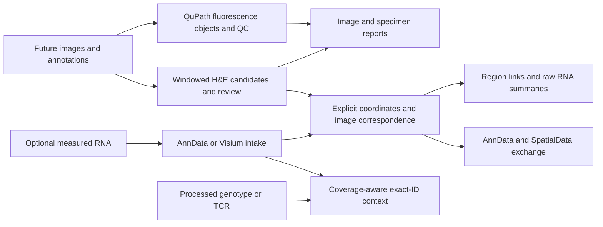

# IFQuant Platform

| Claim | Status | Evidence (artefact path) | Notes |
| --- | --- | --- | --- |
| Core IF contracts, governance, references, splits and evaluation software run on engineering fixtures | Descriptive only | `validation/evidence/stages-1-4-20261009.json` | Existing fluorescence v1 boundaries retained; real-data gates remain open. |
| Native QuPath pilot exported and passed structural checks | Descriptive only | `validation/PHASE1_QC_STATUS.md` | Run 05: 1,803 candidates; 194 accepted topology warnings await H2. |
| StarDist fresh export and deterministic QC succeeded | Descriptive only | `validation/evidence/stages-1-4-20261009.json` | Run 11: 2,380 candidates, 2,308 accepted, 72 excluded; 1,322 accepted topology warnings. |
| High-resolution intake, H&E candidate workflow and specimen/cell reports execute | Descriptive only | `validation/evidence/priorities-1-5-20261009.json` | Real 46,000 × 32,914-pixel window benchmark and QuPath label bridge; no real H&E accuracy or whole-slide analysis throughput claim. |
| Scientific accuracy, injury severity, lineage and backend equivalence | Not established | `docs/STAGES_1_4_STATUS.md` | Independent data, reviewer decisions and endpoint-specific evaluation required. |
| Earlier combined claim that InstanSeg and native AnnData/SpatialData adapters were unimplemented | Retracted-superseded | `validation/evidence/priorities-1-2-20261009.json` | Native adapters now execute; InstanSeg remains a separate pending executor. |
| Native spatial interchange and real lung intake replay | Descriptive only | `validation/evidence/priorities-1-2-20261009.json` | Exact-ID AnnData/Visium/SpatialData exchange and selected raw-count reconciliation; no biological inference. |
| Processed spatial RNA, explicit affine region links and genotype/TCR missingness | Descriptive only | `validation/evidence/stages-5-6-20261009.json` | CSV/affine foundation; native interchange is implemented separately. Paper-level biological reproduction remains unestablished. |
| Calibrated morphology, RNA programs, graph baselines, registration QC and frozen spatial hypotheses execute | Descriptive only | `validation/evidence/priorities-1-5-20261009.json` | Ten synthetic workflow examples; real intended-use validation gates remain open. |
| Slide-GoTags published table/figure statistics reconcile | Descriptive only | `validation/evidence/priorities-1-5-20261009.json` | 240 rows / six RCC_1_A pairs match; no cell-level NMS or p-value recomputation. |

IFQuant Platform is a **QuPath-first high-resolution tissue imaging and spatial
phenotyping tool**, with lung injury/regeneration as its first application.
It supports future obtainable images; public and synthetic data are development
resources. A separate H&E module complements the governed fluorescence workflow.
Optional measured spatial RNA and processed genotype/TCR context connect assays
to imaging. Native AnnData/Visium/SpatialData interchange and one real lung intake
example now execute. The [active plan](docs/DEVELOPMENT_PLAN.md) orders the
imaging, biological-context and TME work, with all 31 jobs through priority 5
assigned an implementation/evidence status and explicit remaining gate.

> **Scientific status:** engineering checks do not approve a detector, endpoint,
> lesion grade or model as biologically valid, equivalent or universal.

Original source is [MIT licensed](LICENSE); [third-party terms](THIRD_PARTY_NOTICES.md)
remain separate. The historical `IFQuant-Lung` repository remains read-only.
The current software is an engineering implementation, not a scientific release.
See [current progress](PROGRESS.md) and [remaining jobs](docs/DEVELOPMENT_PLAN.md).

| If you want… | Read |
| --- | --- |
| Run H&E, correction/review, cell or specimen workflows | [Tissue workflow guide](docs/TISSUE_WORKFLOW.md) |
| Import RNA, exchange native formats or replay the real lung example | [Spatial interchange](docs/SPATIAL_INTERCHANGE.md) |
| Run morphology/RNA/statistics or registration examples | [Analysis workflows](docs/ANALYSIS_WORKFLOW.md), [imaging qualification](docs/IMAGING_QUALIFICATION.md) |
| Read the overall development result and revisions | [Execution report](docs/EXECUTION_REPORT.md) |
| See current jobs and optional multimodal/TME gates | [Active plan](docs/DEVELOPMENT_PLAN.md), [stage 5–6 pipeline](docs/STAGES_5_6_PIPELINE.md) |
| Follow detailed IF/reference governance | [Fluorescence workflow](docs/FLUORESCENCE_WORKFLOW.md) |
| See implementation evidence and remaining work | [Stage status](docs/STAGES_1_4_STATUS.md), [progress](PROGRESS.md) |
| Review papers and the future omics/TME pipeline | [Methodology roadmap](notes/2026-10-09-development-roadmap.md) |
| Understand governance and backend gates | [Responsibilities](docs/RESPONSIBILITY_BOUNDARIES.md), [StarDist status](docs/PHASE5_STATUS.md) |
| Inspect human decisions and AI contributions | [Development record](DEVELOPMENT.md) |
| Continue development | [Agent context](AI_CONTEXT.md) |

## Try it yourself

From a clean clone, with Python 3.11+ and uv installed; no image download required:

```powershell
uv sync --locked --extra dev --extra imaging
uv run --no-sync python -m ifquant_platform demo-histology --output validation/output/demo
uv run --no-sync python -m ifquant_platform validate-histology validation/output/demo/run
uv run --no-sync python -m ifquant_platform report-specimens validation/output/demo/run --output validation/output/specimen-demo
```

Open `validation/output/demo/run/report.html` and
`validation/output/specimen-demo/report.html`. Use fresh destination names for
subsequent runs. The demo is entirely synthetic and deliberately leaves review
pending. For real-image intake, QuPath export, immutable corrections, marker
thresholds and ordinal forms, follow the [guide](docs/TISSUE_WORKFLOW.md).

## Platform workflow



The shared rules are explicit biological identities, content-bound inputs,
coordinates/units, retained missingness, review lineage and fresh output packages.
H&E appearance classes are not injury grades. Adjacent sections do not identify
the same individual cells. Software checks do not establish biological validity.
See the [architecture](docs/ARCHITECTURE.md) and [responsibilities](docs/RESPONSIBILITY_BOUNDARIES.md).

To run the real Kasmani lung intake example:

```powershell
uv sync --locked --extra dev --extra imaging --extra spatialdata
uv run --no-sync python scripts/replay_lung_example.py --download --output validation/output/kasmani-day3
```

Open `validation/output/kasmani-day3/report.html`. Four pinned public files total
about 15 MB compressed. The H&E image is a deposited derivative; the five-gene
panel checks raw-count reconciliation and interchange, not paper-level biological
comparisons or scanner-scale performance. Data and generated stores stay outside
Git. See [the guide](docs/SPATIAL_INTERCHANGE.md) for supported platforms/limits.

For ten runnable synthetic analysis plans covering morphology, reviewer agreement,
RNA programs, spatial baselines, registration and processed TME context:

```powershell
uv sync --locked --extra dev --extra imaging --extra morphology --extra performance --extra spatialdata
uv run --no-sync python scripts/demo_development_pipeline.py --output validation/output/development-demo
```

The [analysis guide](docs/ANALYSIS_WORKFLOW.md) also includes the pinned real WSI
and published-source replay. InstanSeg, cell2location/Tangram, BANKSY and optional
fusion/interaction engines remain conditional; their implementation is not implied
by the analysis interfaces.

## Repository map

- `contracts/` — closed schemas, canonicalization vectors, and example methods.
- `qupath/scripts/` — narrow configuration-driven QuPath executors.
- `src/ifquant_platform/` — Python contracts, canonicalization, validation,
  provenance, backend registry, and CLI.
- `datasets/` — versioned manifest and split-governance workspace.
- `ml/` — scope-specific training, evaluation, and model packaging.
- `validation/` — fixtures, engineering records, and validation design.
- `pipelines/` — reproducible orchestration and artifact hand-off.
- `compat/g_surf/` — isolated frozen compatibility references only.
- `tests/` — contract, canonicalization, package, backend, and QuPath tests.
- `docs/` — architecture, boundaries, and roadmap.

## Local verification

```powershell
uv run --no-sync pytest -q
```

Run the full suite in the environment with the spatial extras. CI also checks
an imaging-only environment so core commands remain independent of omics.
Current results are in [PROGRESS](PROGRESS.md). Historical fluorescence Phases
1–9 and current development priorities are distinct; [the active plan](docs/DEVELOPMENT_PLAN.md)
maps them. Detailed retained CLI/reference checks are in the
[fluorescence workflow](docs/FLUORESCENCE_WORKFLOW.md).

## Design guardrails

- QuPath is the primary image and review environment; model training stays in
  Python.
- Paths, channels, annotations, thresholds, models, and output destinations
  arrive through validated configuration, never hidden workstation defaults.
- Native QuPath, StarDist, and InstanSeg share an interface, not an equivalence
  claim.
- Images, annotations, splits, preprocessing, code, weights, corrections, and
  outputs are versioned and content-addressed.
- Missing identities and required measurements fail closed; they are not
  inferred or converted to zero.
- Human correction creates a successor revision and never mutates frozen labels
  or held-out test data in place.
- A split successor must preserve prior assignments and the exact held-out ID
  and reference-content locks. Valid train/tuning-only evolution remains
  possible under the declared successor policy.
- Fiji remains only a frozen G-SURF compatibility and regression reference.
- No historical production structure, authority, or release output enters the
  new core.
