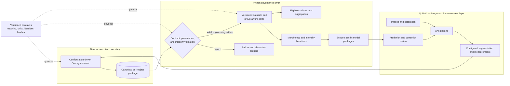

# IFQuant Platform

IFQuant Platform is the clean-slate, QuPath-first and Python-governed successor
for reproducible immunofluorescence cell analysis. It separates interactive
image work from contracts, provenance, dataset governance, validation,
statistics, and scope-specific machine learning.

> **Scientific status:** the repository has completed its initial engineering
> scaffold and a structurally valid QuPath pilot. It is not a scientifically
> validated measurement system. No detector, backend, endpoint, or model is
> approved as biologically valid, equivalent, or universal.

The historical `IFQuant-Lung` repository remains a read-only G-SURF record.
Historical authority files, release outputs, production layout, and unrelated
working-tree changes are not copied into this core.

## Current status

| Workstream | Status | Evidence or next gate |
| --- | --- | --- |
| Clean-slate repository and Python package | Complete | Package, contracts, CLI, tests, and ownership boundaries are in place. |
| Backend-neutral measurement contracts | Initial v1 complete | Closed schemas bind meaning, parameters, canonical hashes, and provenance. |
| Canonical cell-object package | Initial v1 complete | Image, channel, calibration, annotation, geometry, measurements, model/detector, QC, review, and provenance are bound. |
| Native QuPath executor | Full-frame engineering pilot complete | QuPath 0.7 ran the configured exporter on the complete 2048 × 2048 image with a manifest-bound symmetric detector-resolution edge guard. |
| Structural validation CLI | Complete for v1 engineering scope | Referential, canonical, geometry, count, QC, review, and byte-integrity checks pass the pilot and fixtures. |
| DAPI visual-QC evidence | Provisionally acceptable; formal H1/H2 records open | The user described the overlay as seemingly acceptable and requested full-image detection. Run 05 retains all 1,803 candidates and independently verifies a four-side image-edge guard; detected-object eligibility still requires a topology-warning decision. See [Phase 1 QC status](validation/PHASE1_QC_STATUS.md). |
| StarDist and InstanSeg | Interface candidates | Adapters and validation evidence are not yet implemented; no equivalence is assumed. |
| Governed observations and correction lineage | Initial Phase 2 contract complete; real intake gated | A closed observation-set contract and strict read-only validator now bind source bytes, canonical manifest identities, producer code, explicit biological/acquisition identity, and annotation lineage with a reviewed selected revision. |
| ML baselines and custom models | Planned | DAPI segmentation comparison, then morphology/intensity classifiers; custom CNNs only if justified. |
| Scientific validation | Not established | Requires prospective, scope-specific evaluation by mouse, slide, batch, scanner, and endpoint. |

## Architecture

The central rule is **meaning is versioned separately from execution**.
Contracts state what an artifact means; QuPath performs configured image work;
the canonical package carries evidence; Python independently validates and
governs every downstream use.



### Responsibility boundaries

| Owner | Responsible for | Explicitly outside its authority |
| --- | --- | --- |
| QuPath UI | Viewing, annotation, segmentation inspection, correction, prediction review | Dataset versions, split assignment, training, statistics |
| `qupath/scripts/` | Deterministic configured execution and canonical export | Hard-coded study paths, model training, hidden endpoint rules |
| `contracts/` | Field meaning, units, identities, canonical form, method binding | Runtime paths, UI state, scientific approval |
| `src/ifquant_platform/` | Canonicalization, validation, hashing, provenance, QC/review rules | Interactive image editing and backend-specific UI behavior |
| `datasets/` | Immutable manifests, lineage, group-aware partitions | Mutable labels, tile-random leakage, model code |
| `ml/` | Training, evaluation, calibration, abstention, portable model packages | Universal-model claims and implicit datasets |
| `validation/` | Engineering fixtures and scientific-evidence plans | Promotion by implication |
| `compat/g_surf/` | Optional frozen compatibility descriptors | Historical authority or new-core dependencies |

The full ownership matrix is in
[Responsibility boundaries](docs/RESPONSIBILITY_BOUNDARIES.md).

## Target process: one governed analysis run

1. Register immutable image bytes, biological-unit identity, channel mapping,
   calibration, acquisition groups, and supplied annotations.
2. Bind a measurement definition, parameter set, backend configuration,
   preprocessing profile, runtime artifacts, and fresh output destination.
3. Run a narrow Groovy executor inside QuPath, scoped to supplied annotations.
4. Export cell/nucleus geometry, calibrated morphology, compartment intensity,
   detector/model identity, QC, review state, and provenance.
5. Validate the complete package independently in Python. Invalid or ambiguous
   packages stop here; downstream code does not repair them silently.
6. Publish reviewed identities, images, annotations, and corrections into a new
   immutable governed observation-set revision.
7. Freeze a separate mouse/slide/batch/scanner-aware split manifest; never infer
   groups from paths or assign randomly by tile.
8. Train or evaluate a scope-specific model outside Groovy, then return
   predictions and uncertainty to QuPath for human review.
9. Aggregate only compatible, eligible, reviewed packages while retaining
   failed and abstained units.

The canonical package is the hand-off point, not a scientific approval stamp:

```text
package.json
cell_objects.jsonl
manifests/
  image-manifest.json
  channel-map.json
  annotation-set.json
  segmentation-run.json
contracts/
  measurement-definition.json
  parameter-set.json
```

See [Architecture](docs/ARCHITECTURE.md) and
[Contracts](contracts/README.md) for the invariants and canonical hashing rules.

## Current QuPath pilot

Run 05 exercised the full native-QuPath-to-Python boundary on the complete
2048 × 2048 four-channel singleton-Z/T OME-TIFF engineering derivative. DAPI
native watershed detection used one supplied full-image annotation and a
declared one-processing-pixel boundary guard.

- 1,803 nuclei detected and retained in the candidate ledger;
- 1,700 canonical cell objects exported;
- 103 candidates excluded within the image guard;
- independently recomputed guard sides: top 33, left 23, right 27, bottom 21;
- zero accepted candidates inside the guard;
- 204 topology warnings across all candidates, including 194 accepted objects;
- deterministic overview, disposition, montage, and manifest bytes across two
  fresh render destinations; and
- Python package and candidate validators report `valid` for engineering
  structure, references, geometry policy, and byte integrity only.

Canonical package SHA-256:
`e086130f68823ef30dd30e4b0f596dcf3842cff215b7b2638e02ecccc5e5125f`.

The detailed current record is in
[Phase 1 QC status](validation/PHASE1_QC_STATUS.md); earlier pilot lineage remains
in [Pilot status](validation/PILOT_STATUS.md). Microscopy bytes, cell output,
workstation paths, and full evidence bundles remain under the Git-ignored local
`validation/output/` directory and are **not published in this repository**.

The user described DAPI appearance as seemingly acceptable and requested
full-image detection. The symmetric guard is an engineering result that is
independently verified on all four image sides; a formal reviewer decision is
not yet recorded. H2 warning disposition is still open, with conservative
exclusion as the default for downstream eligibility. No pilot establishes
scientific validity, backend equivalence, endpoint fitness, or authorization
for biological use.

## Roadmap

Development advances in evidence-gated phases. The normative order, current
phase, and exit criteria are in [Development phases](docs/DEVELOPMENT_PHASES.md).
Machine-verifiable gates and the human-review boundaries are separated in
[Decision gates](docs/DECISION_GATES.md). In particular, a valid package does
not resolve a geometry warning or authorize biological use of detected objects.

```mermaid
flowchart LR
    M0["Foundation<br/>contracts, package, CLI,<br/>native QuPath pilot<br/>COMPLETE"]
    Q1["Visual QC stabilization<br/>full-frame guard verified<br/>formal H1 + H2 gates open"]
    M1["Governed data foundation<br/>CURRENT: contract, validator,<br/>lineage, identities"]
    M2["Reference set + safe splits<br/>then DAPI segmentation<br/>backend baselines"]
    M3["Object-classifier baselines<br/>morphology and<br/>compartment intensity"]
    M4["QuPath correction loop<br/>review, lineage,<br/>uncertainty sampling"]
    M5["Scope-specific custom models<br/>only when baselines expose<br/>a predeclared limitation"]
    M6["Prospective validation<br/>bias, calibration, abstention,<br/>domain shift, endpoints"]

    M0 --> Q1 --> M1 --> M2 --> M3 --> M4 --> M5 --> M6
```



### Next architecture priorities

1. Complete governed observation-set intake with user-supplied mouse, slide,
   batch, and scanner identity plus reviewed annotation/correction lineage.
2. Freeze reference and split manifests only after governed observations exist;
   audit leakage without using filenames as biological identity.
3. Implement StarDist and InstanSeg adapters that emit the same package shape
   while retaining distinct method, weights, preprocessing, and runtime
   identities.
4. Establish reviewed DAPI instance-segmentation reference sets and evaluate
   detection, split/merge, boundary, count, and downstream measurement bias.
5. Add morphology/intensity classifier baselines, calibration, uncertainty,
   and abstention before considering a custom CNN.
6. Complete the QuPath prediction-review and immutable correction-lineage loop.
7. Add reproducible pipeline orchestration with fresh destinations, resumable
   hash verification, and assigned/succeeded/failed ledgers.
8. Validate with group-disjoint or blocked designs by mouse, slide, batch, and
   scanner—never by random tile—and quantify domain shift and endpoint bias.

The detailed sequence and evaluation requirements are in the
[ML roadmap](docs/ML_ROADMAP.md).

## Repository map

- `contracts/` — closed schemas, canonicalization vectors, and example methods.
- `qupath/scripts/` — narrow configuration-driven QuPath executors.
- `src/ifquant_platform/` — Python contracts, canonicalization, validation,
  provenance, backend registry, and CLI.
- `datasets/` — versioned manifest and split-governance workspace.
- `ml/` — scope-specific training, evaluation, and model packaging.
- `validation/` — fixtures, engineering records, and validation design.
- `pipelines/` — reproducible orchestration and artifact hand-off.
- `compat/g_surf/` — isolated frozen compatibility references only.
- `tests/` — contract, canonicalization, package, backend, and QuPath tests.
- `docs/` — architecture, boundaries, and roadmap.

## Local verification

Requires Python 3.11 or newer. The core runtime validator uses only the Python
standard library.

```powershell
python -m pip install -e .
python -m unittest discover -s tests -v

ifquant-platform validate-method `
  contracts/examples/cell-morphology-intensity-v1.json `
  --parameter-set contracts/examples/cell-morphology-intensity-engineering-v1.json

ifquant-platform validate-package validation/fixtures/minimal-cell-package
ifquant-platform validate-observation-set `
  validation/fixtures/minimal-governed-observation-set
ifquant-platform backends
```

Deterministic DAPI review images use optional Pillow and NumPy dependencies:

```powershell
python -m pip install -e ".[qc]"
ifquant-platform render-qc "X:\absolute\qupath-output" `
  --output "X:\absolute\fresh-qc-output"
```

The renderer validates all package and candidate-ledger bindings before image
generation. Its outputs are review evidence, not a completed QC decision.

The QuPath executor, configuration contract, fail-closed checks, and headless
command are documented in [QuPath pilot executor](qupath/README.md).

## Design guardrails

- QuPath is the primary image and review environment; model training stays in
  Python.
- Paths, channels, annotations, thresholds, models, and output destinations
  arrive through validated configuration, never hidden workstation defaults.
- Native QuPath, StarDist, and InstanSeg share an interface, not an equivalence
  claim.
- Images, annotations, splits, preprocessing, code, weights, corrections, and
  outputs are versioned and content-addressed.
- Missing identities and required measurements fail closed; they are not
  inferred or converted to zero.
- Human correction creates a successor revision and never mutates frozen labels
  or held-out test data in place.
- Fiji remains only a frozen G-SURF compatibility and regression reference.
- No historical production structure, authority, or release output enters the
  new core.
