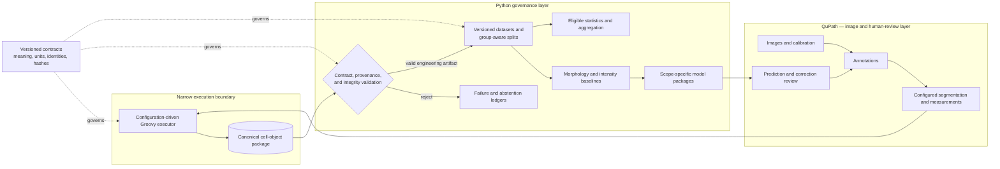
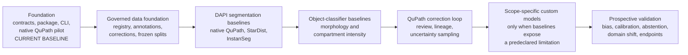

# IFQuant Platform

IFQuant Platform is the clean-slate, QuPath-first and Python-governed successor
for reproducible immunofluorescence cell analysis. It separates interactive
image work from contracts, provenance, dataset governance, validation,
statistics, and scope-specific machine learning.

> **Scientific status:** the repository has completed its initial engineering
> scaffold and a structurally valid QuPath pilot. It is not a scientifically
> validated measurement system. No detector, backend, endpoint, or model is
> approved as biologically valid, equivalent, or universal.

The historical `IFQuant-Lung` repository remains a read-only G-SURF record.
Historical authority files, release outputs, production layout, and unrelated
working-tree changes are not copied into this core.

## Current status

| Workstream | Status | Evidence or next gate |
| --- | --- | --- |
| Clean-slate repository and Python package | Complete | Package, contracts, CLI, tests, and ownership boundaries are in place. |
| Backend-neutral measurement contracts | Initial v1 complete | Closed schemas bind meaning, parameters, canonical hashes, and provenance. |
| Canonical cell-object package | Initial v1 complete | Image, channel, calibration, annotation, geometry, measurements, model/detector, QC, review, and provenance are bound. |
| Native QuPath executor | Engineering pilot complete | QuPath 0.7 ran the configured annotation-scoped exporter successfully. |
| Structural validation CLI | Complete for v1 engineering scope | Referential, canonical, geometry, count, QC, review, and byte-integrity checks pass the pilot and fixtures. |
| DAPI visual-QC evidence | Phase 1 in progress | Complete candidate dispositions and deterministic overview/overlay/montage rendering are implemented; human geometry review remains a required gate. |
| StarDist and InstanSeg | Interface candidates | Adapters and validation evidence are not yet implemented; no equivalence is assumed. |
| Dataset manifests and correction lineage | Architecture defined | Persistent registry, immutable versions, and QuPath correction ingestion are next. |
| ML baselines and custom models | Planned | DAPI segmentation comparison, then morphology/intensity classifiers; custom CNNs only if justified. |
| Scientific validation | Not established | Requires prospective, scope-specific evaluation by mouse, slide, batch, scanner, and endpoint. |

## Architecture

The central rule is **meaning is versioned separately from execution**.
Contracts state what an artifact means; QuPath performs configured image work;
the canonical package carries evidence; Python independently validates and
governs every downstream use.



### Responsibility boundaries

| Owner | Responsible for | Explicitly outside its authority |
| --- | --- | --- |
| QuPath UI | Viewing, annotation, segmentation inspection, correction, prediction review | Dataset versions, split assignment, training, statistics |
| `qupath/scripts/` | Deterministic configured execution and canonical export | Hard-coded study paths, model training, hidden endpoint rules |
| `contracts/` | Field meaning, units, identities, canonical form, method binding | Runtime paths, UI state, scientific approval |
| `src/ifquant_platform/` | Canonicalization, validation, hashing, provenance, QC/review rules | Interactive image editing and backend-specific UI behavior |
| `datasets/` | Immutable manifests, lineage, group-aware partitions | Mutable labels, tile-random leakage, model code |
| `ml/` | Training, evaluation, calibration, abstention, portable model packages | Universal-model claims and implicit datasets |
| `validation/` | Engineering fixtures and scientific-evidence plans | Promotion by implication |
| `compat/g_surf/` | Optional frozen compatibility descriptors | Historical authority or new-core dependencies |

The full ownership matrix is in
[Responsibility boundaries](docs/RESPONSIBILITY_BOUNDARIES.md).

## Target process: one governed analysis run

1. Register immutable image bytes, biological-unit identity, channel mapping,
   calibration, acquisition groups, and supplied annotations.
2. Bind a measurement definition, parameter set, backend configuration,
   preprocessing profile, runtime artifacts, and fresh output destination.
3. Run a narrow Groovy executor inside QuPath, scoped to supplied annotations.
4. Export cell/nucleus geometry, calibrated morphology, compartment intensity,
   detector/model identity, QC, review state, and provenance.
5. Validate the complete package independently in Python. Invalid or ambiguous
   packages stop here; downstream code does not repair them silently.
6. Publish reviewed objects and corrections into a new immutable dataset
   version with mouse/slide/batch/scanner-aware split membership.
7. Train or evaluate a scope-specific model outside Groovy, then return
   predictions and uncertainty to QuPath for human review.
8. Aggregate only compatible, eligible, reviewed packages while retaining
   failed and abstained units.

The canonical package is the hand-off point, not a scientific approval stamp:

```text
package.json
cell_objects.jsonl
manifests/
  image-manifest.json
  channel-map.json
  annotation-set.json
  segmentation-run.json
contracts/
  measurement-definition.json
  parameter-set.json
```

See [Architecture](docs/ARCHITECTURE.md) and
[Contracts](contracts/README.md) for the invariants and canonical hashing rules.

## Initial QuPath pilot

The 2026-08-29 pilot exercised the full native-QuPath-to-Python boundary with
QuPath 0.7.0, a four-channel singleton-Z/T OME-TIFF engineering derivative,
DAPI-based native watershed detection, and one explicitly synthetic ROI.

- 1,551 nuclei detected;
- 1,453 canonical cell objects exported;
- 45 cells excluded because they crossed the annotation;
- 53 cells excluded because they touched the annotation boundary;
- 182 exported objects flagged because normalized nucleus geometry was not
  covered by cell geometry;
- 1,453 unique object IDs with contiguous indices;
- 42 unit tests passing; and
- Python validator status `valid` for structural, referential, and byte
  integrity only.

Canonical package SHA-256:
`977f2780eaa625c8332e886d1a0dbe6c6749b42bd33000a097713125258fae2f`.

The detailed, sanitized record is in
[Pilot status](validation/PILOT_STATUS.md). The microscopy derivative,
per-cell output, workstation paths, and full evidence bundle remain under the
Git-ignored local `validation/output/` directory and are **not published in
this repository**.

This pilot does not establish segmentation accuracy, geometry acceptance,
scientific validity, backend equivalence, endpoint fitness, or authorization
for biological analysis.

## Roadmap

Development advances in evidence-gated phases. The normative order, current
phase, and exit criteria are in [Development phases](docs/DEVELOPMENT_PHASES.md).
Machine-verifiable gates and the human-review boundaries are separated in
[Decision gates](docs/DECISION_GATES.md). In particular, a valid package does
not resolve a geometry warning or authorize Phase 2 biological-data use.



### Next architecture priorities

1. Implement immutable image, annotation, correction, dataset, and split
   manifests without using filenames as biological identity.
2. Implement StarDist and InstanSeg adapters that emit the same package shape
   while retaining distinct method, weights, preprocessing, and runtime
   identities.
3. Establish reviewed DAPI instance-segmentation reference sets and evaluate
   detection, split/merge, boundary, count, and downstream measurement bias.
4. Add morphology/intensity classifier baselines, calibration, uncertainty,
   and abstention before considering a custom CNN.
5. Complete the QuPath prediction-review and immutable correction-lineage loop.
6. Add reproducible pipeline orchestration with fresh destinations, resumable
   hash verification, and assigned/succeeded/failed ledgers.
7. Validate with group-disjoint or blocked designs by mouse, slide, batch, and
   scanner—never by random tile—and quantify domain shift and endpoint bias.

The detailed sequence and evaluation requirements are in the
[ML roadmap](docs/ML_ROADMAP.md).

## Repository map

- `contracts/` — closed schemas, canonicalization vectors, and example methods.
- `qupath/scripts/` — narrow configuration-driven QuPath executors.
- `src/ifquant_platform/` — Python contracts, canonicalization, validation,
  provenance, backend registry, and CLI.
- `datasets/` — versioned manifest and split-governance workspace.
- `ml/` — scope-specific training, evaluation, and model packaging.
- `validation/` — fixtures, engineering records, and validation design.
- `pipelines/` — reproducible orchestration and artifact hand-off.
- `compat/g_surf/` — isolated frozen compatibility references only.
- `tests/` — contract, canonicalization, package, backend, and QuPath tests.
- `docs/` — architecture, boundaries, and roadmap.

## Local verification

Requires Python 3.11 or newer. The core runtime validator uses only the Python
standard library.

```powershell
python -m pip install -e .
python -m unittest discover -s tests -v

ifquant-platform validate-method `
  contracts/examples/cell-morphology-intensity-v1.json `
  --parameter-set contracts/examples/cell-morphology-intensity-engineering-v1.json

ifquant-platform validate-package validation/fixtures/minimal-cell-package
ifquant-platform backends
```

Deterministic DAPI review images use optional Pillow and NumPy dependencies:

```powershell
python -m pip install -e ".[qc]"
ifquant-platform render-qc "X:\absolute\qupath-output" `
  --output "X:\absolute\fresh-qc-output"
```

The renderer validates all package and candidate-ledger bindings before image
generation. Its outputs are review evidence, not a completed QC decision.

The QuPath executor, configuration contract, fail-closed checks, and headless
command are documented in [QuPath pilot executor](qupath/README.md).

## Design guardrails

- QuPath is the primary image and review environment; model training stays in
  Python.
- Paths, channels, annotations, thresholds, models, and output destinations
  arrive through validated configuration, never hidden workstation defaults.
- Native QuPath, StarDist, and InstanSeg share an interface, not an equivalence
  claim.
- Images, annotations, splits, preprocessing, code, weights, corrections, and
  outputs are versioned and content-addressed.
- Missing identities and required measurements fail closed; they are not
  inferred or converted to zero.
- Human correction creates a successor revision and never mutates frozen labels
  or held-out test data in place.
- Fiji remains only a frozen G-SURF compatibility and regression reference.
- No historical production structure, authority, or release output enters the
  new core.
