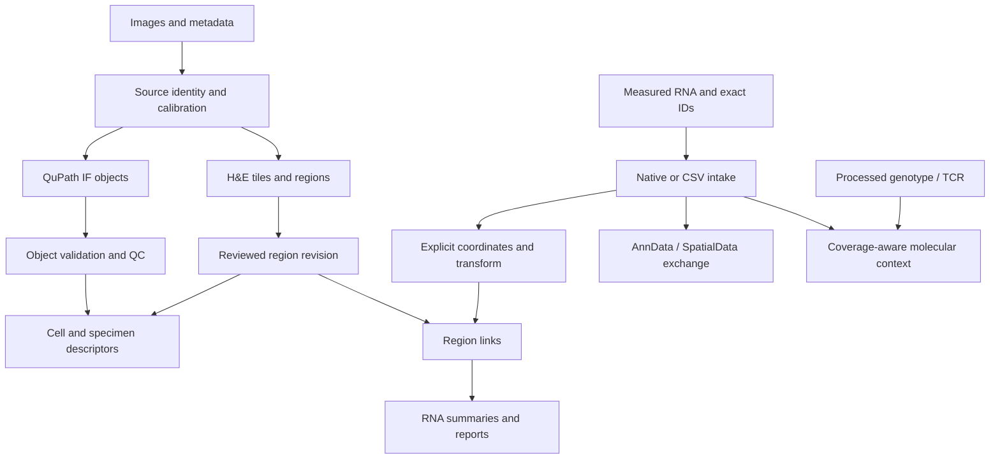

# Platform architecture

IFQuant Platform supports future high-resolution tissue images, with lung
injury/regeneration first. Fluorescence objects, H&E morphology/regions and
optional measured spatial assays share identity, coordinates, provenance and
review boundaries. Each imaging path remains useful without omics.

## Current layers

| Layer | Implemented boundary | Remaining qualification |
| --- | --- | --- |
| Image intake | Calibrated identities, multi-file inventories, bounded TIFF windows, core/halo plans and QuPath RGB bridge | Real vendor/codec coverage and scanner-scale performance |
| Fluorescence | Native/StarDist execution, canonical objects, QC, references/splits and evaluation software | Human review, independent references and backend comparison |
| H&E | Separate stain profiles, frozen Lab clustering/nearest-centroid baseline, supplied regions, corrections and descriptive area reports | Validated anatomy/lesion models and disease-specific severity evidence |
| Spatial RNA | CSV/native sparse AnnData/classic Visium intake, supplied affine links, raw-count summaries and named-frame SpatialData exchange | Biological programs, composition/domain evaluation and general external-format coverage |
| Molecular context | Processed genotype/TCR exact-ID links, coverage and missingness | Source-specific replay, registration qualification and spatial hypothesis testing |
| Reports/evidence | CLI/HTML, fresh outputs, content-bound inputs and independent validators | Intended-use scientific validation and a custom GUI |

## Artifact flow

Contracts define meaning; executors record what ran. Spatial assays carry
species/subject/specimen/section, entity type, XY frame and sparse raw counts.
Unknown rows remain distinct from measured zero. Transforms name their direction
and same/serial-section relationship. Landmark errors do not themselves grant
scientific registration acceptance.

The original fluorescence contracts remain strict and separate from `tissue/v1/`
and `spatial/v1/`. Native adapters retain source inventories and selections.
SpatialData uses a documented IFQuant profile with per-file hashes, table/point
identity and named transformations. General store discovery is a separate job.

## Scale and interpretation

Windowed TIFF processing is the high-resolution path. SpatialData scenes accept
bounded RGB derivatives and their pyramids; that export is not a general
OME-NGFF source reader or a performance benchmark. Physical morphology/distance
endpoints require explicit calibration. Pixel-only examples may still check
overlays and counts without inventing micrometer values or pathological labels.

Corrections produce successor revisions. Missingness, failed units, exclusions
and uncertainty remain visible. A study's biological identities define replication,
not its tile/spot count. Software validity does not establish injury severity,
lineage, antigen recognition or backend equivalence.

See [the active plan](DEVELOPMENT_PLAN.md) and [current evidence](../PROGRESS.md).
Detailed retained fluorescence contracts are in
[Fluorescence architecture](FLUORESCENCE_ARCHITECTURE.md) and
[Fluorescence workflow](FLUORESCENCE_WORKFLOW.md). Historical IFQuant-Lung/G-SURF
approvals do not transfer into this platform automatically.
