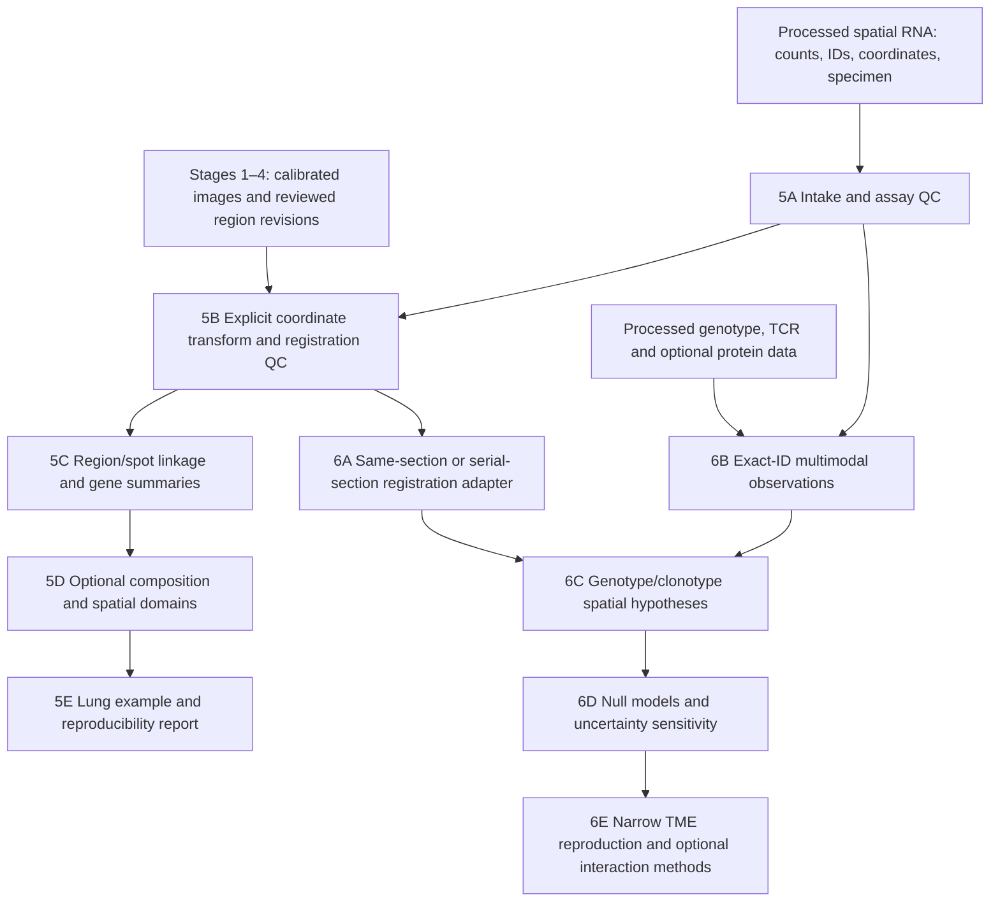

# Stages 5–6: spatial RNA and optional multimodal applications

Updated 2026-10-09 after implementation through priorities 1–5. Stage 5 is
roadmap WP4; stage 6 is WP5. These names do not replace the historical fluorescence
Phase 5 backend gate. The imaging product targets future high-resolution images;
RNA and TME remain optional.

**Implemented:** exact-ID processed RNA/context, supplied affine links, native
AnnData/Visium/SpatialData, the real Kasmani intake replay, RNA program/filtering
and domain baselines, biological-unit associations, portable VALIS point export/QC,
a processed MC38-OVA author-column adapter and frozen mixing hypotheses/nulls.
**Still conditional:** real expert/reference qualification, actual paired-slide
registration, full processed-cell TME reproduction, reference deconvolution,
BANKSY and interaction/fusion comparisons. See the [31-job register](DEVELOPMENT_PLAN.md)
and [analysis commands](ANALYSIS_WORKFLOW.md).

Local integrated verification: **202 tests and 144 subtests passed**. The real lung
replay and public WSI/source-table checks are recorded in
[the execution report](EXECUTION_REPORT.md). Public source-statistic reconciliation
is not cell-level biological reproduction.

## Dependency graph



Registration checks are a dependency of spatial linkage, even though automatic
registration qualification is represented in stage 6. Stage 5 can use a supplied, measured transform
or a documented same-image scale conversion. Adjacent sections can support
regional correspondence; they do not establish identical individual cells.

## Stage 5 — associate measured spatial RNA with image phenotypes

| Step / status | Inputs and operations | Output | Exit evidence |
| --- | --- | --- | --- |
| **5A.1 Implemented foundation** | Explicit subject/specimen/section, spot/nucleus/cell entity, XY frame, observation table, feature IDs and sparse integer RNA counts. Validate exact IDs, duplicates, finite coordinates, assay status and input hashes. | `spatial-assay/1`, library totals, source inventory. | Unknown/duplicate IDs and noninteger counts rejected; measured zero distinguished from unassayed/failed; byte drift detected. |
| **5A.2 Implemented native interchange** | Read an explicitly named raw-count layer from AnnData; read Visium positions, barcode/feature tables, sparse matrix and scale factors. Preserve barcode suffixes, duplicate gene symbols with unique feature IDs, and excluded observations. | Round-trip AnnData plus SpatialData elements mapped to named coordinate systems. | Exact observation/feature order and counts survive export/reimport; sparse storage remains sparse; no silent `.var_names_make_unique()` or barcode rewriting. |
| **5B.1 Implemented foundation** | Provided affine from assay frame to base-image pixels; bind both identities and section relationship. Evaluate supplied fit and held-out landmark roles separately in micrometers. | Transform record, inverse round-trip check, per-role RMSE/max error. | Rotation/reflection/anisotropic calibration tests; singular transforms and cross-subject/specimen joins rejected; absence of evaluation landmarks remains `not_evaluated`. |
| **5B.2 QC implemented; real qualification gated** | Review landmark distribution, plane/section pairing, spatial uncertainty and residuals on locations not used for fitting. Record image provenance and downsampling explicitly. | Scope-specific registration acceptance record and uncertainty field. | Numeric tolerance and local landmark coverage prospectively defined for the endpoint. Synthetic zero error is not empirical registration accuracy. |
| **5C.1 Implemented foundation** | Transform point centers to reviewed/pending reference regions; exclude supplied artifacts; abstain at uncertain boundaries and reference overlaps. Reconcile raw RNA totals only over measured linked observations. | `spatial-links/1`, observation CSV, region/feature raw sums and report. | Counts reconcile; holes/edges tested; no hard cell assignment for spots; no numeric aggregate from unassayed observations. |
| **5C.2 Software implemented; biological programs gated** | Bind lung marker/gene-set versions, species/ID mapping, count filtering and normalization. Retain raw counts alongside normalized summaries; choose section/subject as sampling units. | Versioned region-level RNA programs linked to H&E/IF descriptors. | Held-out gene/protein or independently annotated agreement; gene-set coverage and unknown labels retained. Morphology association does not establish lineage or regenerative fate. |
| **5D Baselines implemented; advanced engines conditional** | Branch on assay resolution. Use supplied single-cell labels or reference mapping for cell/nucleus assays. Consider cell2location for mixed-cell spots with an appropriate reference. Compare simple spatial neighborhoods with BANKSY domains. | Cell abundance estimates with uncertainty, or candidate spatial domains with method identity. | Independent reference suitability; subject-level holdout; stable results across radius/registration choices; new methods outperform a declared baseline for the selected endpoint. |
| **5E Real intake replay demonstrated** | Select one manageable influenza-lung spatial-RNA example; inventory accessible files, terms, resolution, preprocessing and biological grouping. Replay the same adapters on future image/assay inputs. | Reproducible acquisition manifest, commands, expected checks and report. | Public example actually reproduced with hashes; limitations and missing native-resolution images explicit. No public-data-only product restriction. |

The dependency-light CSV interchange remains available. AnnData/SpatialData and
classic Visium now have locked optional extras, sparse limits, real round trips
and Linux/Windows CI coverage. Named frames and provenance bindings are retained. Sources:
[AnnData](https://anndata.readthedocs.io/en/stable/generated/anndata.AnnData.html),
[SpatialData transformations](https://spatialdata.scverse.org/en/stable/tutorials/notebooks/notebooks/examples/transformations.html).

For Visium, map `pxl_col_in_fullres` to X and `pxl_row_in_fullres` to Y. Apply a
hires scale only when the target really is that downsampled image; never twice.
`tissue_hires_image.png` is a derivative, not evidence of native scanner resolution.
Visium HD introduces much larger position tables; this initial bounded adapter
does not claim HD-scale capacity. [Official spatial output definitions](https://www.10xgenomics.com/support/software/space-ranger/latest/analysis/outputs/spatial-outputs).

The composition and domain branches are conditional recommendations:
[cell2location](https://cell2location.readthedocs.io/en/latest/) estimates spatial
cell-type abundance using reference expression signatures;
[BANKSY](https://prabhakarlab.github.io/Banksy/) incorporates nearby expression
features for spatial clustering. Neither should be installed or applied merely
because a dataset has coordinates. Keep estimates distinct from direct measurements.

## Stage 6 — optional multimodal/TME applications

| Step / status | Inputs and operations | Output | Exit evidence |
| --- | --- | --- | --- |
| **6A Point adapter/QC implemented; real run gated** | Wrap an external registration result such as VALIS; retain source/target image identity, full-resolution direction, affine/deformation representation and independent landmarks. | Adapter-specific transform plus common registration QC. | Transform direction and native coordinate round trips checked; deformation grid/Jacobian and landmark errors inspected; adjacent sections never joined as identical cells. The core links retain supplied 2D affines; a separate portable VALIS point-result boundary now preserves nonrigid outputs without flattening them into an affine. |
| **6B.1 Implemented foundation** | Attach processed transcript genotype and TCR observations by exact observation ID within one assay. Preserve measured, unassayed, failed, ambiguous and unreported states. | `molecular-context/1`, per-target coverage and missingness counts. | Unknown IDs and duplicate target observations rejected; measured calls require positive coverage; no geometric nearest-cell join or fabricated negative call. |
| **6B.2 Processed source profile implemented; real cells gated** | Audit one deposited processed sample, its barcode namespaces, spatial coordinates, RNA layer, targeted-variant calls and TCR chains/clonotypes. Preserve dataset sample and preprocessing identities. | Source-specific mapping manifest and processed multimodal bundle. | Every retained join traced to original tables; counts and missingness reconcile with source processing. The MC38-OVA author-column profile is tested on synthetic inputs; actual processed-cell replay and source coverage audit remain required. |
| **6C Hypothesis software implemented** | Predeclare variant-expressing population, clonotype/immune population, region, radius/distance, quality exclusions and independent antigen-specificity evidence if available. | Frozen analysis plan and observed distance/neighborhood statistics. | Explicit tested pair set; no post-hoc radius selection masquerading as confirmation. Spatial proximity alone does not establish antigen recognition, contact or signaling. |
| **6D Conditioned null/sensitivity software implemented** | Randomize labels within appropriate specimen/region/coverage strata while retaining spatial structure; specify exchangeability assumptions. Perturb coordinates using measured registration uncertainty and vary predeclared masks/radii. | Empirical null distribution, effect size, multiple-testing correction and sensitivity envelope. | Null calibration on simulated negatives; subject-level replication; results not driven by density, boundary exclusion or assay coverage. A zero null variance triggers an undefined/abstained result, not an infinite score. |
| **6E Reported-source reconciliation demonstrated; cell replay/fusion gated** | Reproduce one source-defined genotype/clonotype spatial association before broadening. Add protein if measured. Consider LIANA+ only for compatible molecular communication hypotheses; SpatialGlue only for suitably paired spatial modalities. | A reproducible source comparison with explicit discrepancies and optional extension report. | Agreement assessed against the chosen source output, documented exclusions and matched scope. Any inferred interaction or fused domain remains a hypothesis/model result. |

The supplied [Slide-GoTags paper](https://www.nature.com/articles/s41587-026-03194-1)
motivates measured RNA/genotype/TCR linkage. Its data statement lists SCP3655,
SCP3657, SCP3660 and SCP3667; [the authors' code](https://github.com/amitsud/Slide-GoTags)
is the source-specific processing reference. Processed cell files have not been
downloaded because the portal requires sign-in. Public source workbooks were
retrieved and 240 reported rows reconciled; this does not reproduce cell-level NMS. RNA `reference_only` is a
coverage-qualified transcript observation, not a DNA wild-type diagnosis.
TCR presence and clonotype identity require separate antigen-specificity evidence.

Registration and later molecular interpretation references:
[VALIS](https://valis.readthedocs.io/en/latest/),
[LIANA+](https://liana.readthedocs.io/en/stable/), and the
[earlier methodology shortlist](../notes/2026-10-09-development-roadmap.md).
The detailed null design is an IFQuant proposal, not an asserted default of these tools.

## Implementation sequence and acceptance ledger

| Increment | Dependency | Concrete work | State |
| --- | --- | --- | --- |
| **A — Shared identities/coordinates** | Stage 2 source and stage 3 regions | Five closed schemas, raw-RNA import/validation, affine checks, exact region joins, molecular missingness, tests, synthetic CLI example. | Implemented in this PR; engineering validation only. |
| **B — Native spatial interchange** | A | Explicit raw-layer AnnData import/export, selected Visium format profiles, SpatialData named-frame round trips, sparse-memory checks and adapter-specific fixtures. | Implemented and real round trips passed. |
| **C — Lung public replay** | B | Audit one Kasmani influenza example; ingest metadata/counts/coordinates and available histology; reproduce region/spot overlay and a narrow measured gene summary. | Demonstrated on pinned GSM6108348 inputs; all selected gene sums reconcile. |
| **D — Biological context branch** | C plus appropriate reference/labels | Freeze gene programs and baseline, then conditionally compare reference mapping/cell2location/BANKSY. | Program/domain/association software implemented; curated biological references and advanced comparisons remain conditional. |
| **E — Registration and processed TME replay** | A/B and paired/source-specific data | VALIS-result adapter, registration uncertainty, Slide-GoTags processed sample schema, exact genotype/TCR joins. | Implemented boundaries; actual paired slides/processed source cells still required. |
| **F — Spatial hypotheses and nulls** | E plus frozen question and sufficient coverage | Distance/neighborhood tests, stratified nulls, uncertainty sensitivity, one-source reproduction; optional interaction/fusion branches afterward. | Mixing/null software implemented; 240 reported source rows reconciled, full cell-level reproduction gated. |

Future intended-use evaluation remains roadmap WP6/stage 7. Scientific thresholds
are prospectively specified per endpoint once the relevant acquisition and labels
exist. No universal numeric accuracy criterion is invented in this plan.

## Run the initial pipeline

```powershell
uv sync --locked --extra dev --extra imaging
uv run --no-sync python -m ifquant_platform demo-spatial --output validation/output/spatial-demo
uv run --no-sync python -m ifquant_platform validate-spatial validation/output/spatial-demo/assay.json
```

Open `validation/output/spatial-demo/linked/report.html`. The generated bundle
includes a tiny synthetic image, region GeoJSON, RNA CSVs, an import config,
assay manifest, affine transform/landmark, region RNA counts and `context.json`.
It intentionally includes an artifact point, a shared-boundary point, an
out-of-image point, unassayed RNA and incomplete genotype/TCR coverage. These are
engineering test cases, not simulated biological evidence or reviewer approval.

For your own processed tables:

```powershell
uv run --no-sync python -m ifquant_platform import-spatial import.json --output assay.json
uv run --no-sync python -m ifquant_platform link-spatial assay.json --source source.json --regions regions.json --transform transform.json --boundary-uncertainty-um 2 --output spatial-links
uv run --no-sync python -m ifquant_platform attach-molecular-context assay.json --calls molecular.csv --output context.json
```

`import.json` follows `contracts/spatial/v1/spatial-import.schema.json`; the demo
provides a filled example. CSV paths resolve relative to that config. The user
declares species/subject/specimen/section, assay ID, entity type, frame ID/unit,
XY axis order and top-left/downward convention. Convert other coordinate
conventions explicitly before import. Affines map input coordinates into the
registered image's base pixels, and bind canonical assay/source hashes.

| CSV | Exact header | Semantics |
| --- | --- | --- |
| Observations | `observation_id,x,y,assay_status` | Every supplied observation has coordinates; RNA status is `measured`, `not_assayed`, `failed`, or `not_reported`. |
| Features | `feature_id,feature_name` | IDs unique; display names can repeat. No silent species/gene conversion. |
| Counts | `observation_id,feature_id,count` | Sparse nonnegative raw integer RNA counts. Omitted pairs are zero detected counts only for a measured observation; they are not proof of absent expression. |
| Molecular context | `observation_id,modality,target_id,status,value,coverage` | `transcript_genotype` or `tcr`; status measured/not_assayed/failed/ambiguous. A missing row becomes `not_reported`. Positive coverage is required for measured calls; blanks stay null. |

For transcript genotype, measured values are `alternate_detected`, `reference_only`
or `mixed`. For TCR, a measured value is an externally defined clonotype ID; define
its chain/sequence pairing and scope upstream. The current format records supplied
total coverage but does not derive variant calls or assemble TCRs. Whole-cell,
nucleus and spot identities remain distinct even when their string IDs coincide.

### Limits of this first increment

- Up to 200,000 observations, 100,000 features and 1 million sparse count rows;
  no dense matrix is constructed. Duplicate-coordinate detection uses a bounded
  in-memory set, so these limits are engineering guardrails, not benchmarked WSI/HD capacity.
- Up to 10 million point/region and 50 million point/edge comparisons; no spatial
  tree or deformable registration yet. Molecular expansion is capped at 1 million rows.
- Region RNA sums are raw-count reconciliation, not normalized expression,
  differential expression, cell abundance, area burden or biological inference.
- Boundary uncertainty is an explicitly supplied exclusion distance in µm.
  It does not become a statistical confidence interval. Landmark role labels are
  supplied attestations; numerical residuals cannot prove holdout independence.
- A transform without evaluation landmarks remains unqualified. Even a supplied
  evaluation point does not establish sufficient coverage or registration validity.
- Absolute input paths and byte hashes retain provenance; relocated or changed
  input files require a new import. Completed output paths cannot be overwritten.
- `validate-spatial` validates the assay, not a completed multimodal scientific
  study. Independent packaged-output verification for links/context and native
  adapter round trips are subsequent hardening work.
- Public data are a reproducible development example. Future private or newly
  acquired high-resolution images remain first-class intended inputs.

## Resource intake choices

First lung example: [Kasmani influenza spatial sequencing repository](https://github.com/ryanjbrown21/Flu_Spatial_Sequencing),
with GEO accessions GSE202322 (spatial) and GSE202325 (scRNA-seq) from the existing
roadmap. Audit exact sample pairing, age/infection context, image resolution,
file terms and count normalization before selecting a subset. Niethamer's
regeneration atlas remains a candidate expression reference, not measured spatial
ground truth for unrelated images. Select one Slide-GoTags processed deposit only
after the RNA and coordinate adapters work. Raw sequencing and foundation-model
training remain outside this initial pipeline.
