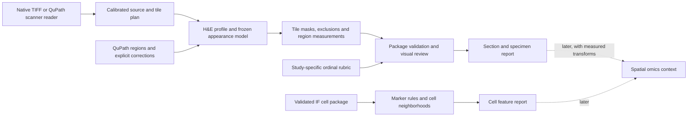

# High-resolution tissue workflow

This is the first engineering implementation of roadmap stages 1–4 (2026-10-09).
The working product is a tool for future high-resolution tissue images, starting
with lung injury/regeneration. Synthetic and public data support development;
they do not define the product's permitted input sources. Omics and TME adapters
remain later extensions. The original IF v1 contracts and evaluation gates remain intact.

## Install and run without private data

Requires Python 3.11+ and [uv](https://docs.astral.sh/uv/). From a clean checkout:

```powershell
uv sync --locked --extra dev --extra imaging
uv run --no-sync python -m ifquant_platform demo-histology --output validation/output/my-demo
uv run --no-sync python -m ifquant_platform validate-histology validation/output/my-demo/run
uv run --no-sync python -m ifquant_platform report-specimens validation/output/my-demo/run --output validation/output/my-specimens
uv run --no-sync python -m ifquant_platform report-cells validation/fixtures/minimal-cell-package --output validation/output/my-cells
```

Open each output's `report.html`. Use a new destination for each run. The H&E demo
generates its own tiled RGB TIFF, profile, region definitions and frozen appearance
model. It leaves review pending and severity missing. The IF fixture demonstrates
software behavior with synthetic measurements. Neither is a biological benchmark.

The `imaging` extra installs NumPy, Pillow, tifffile and Zarr. Add `--extra wsi-codecs`
when a TIFF's compression requires imagecodecs. Optional codecs are separately
locked but were not installed in the local ARM64 smoke environment. The small
demonstration uses uncompressed tiled TIFF. The core IF validation CLI retains
its standard-library-only runtime.

## Pipeline and contracts



The nine closed schemas in `contracts/tissue/v1/` describe source, tile plan,
regions, profile, frozen model, run package, rubric, review and marker thresholds.
`scripts/generate_tissue_schemas.py` generates these checked-in schemas. Python
validators additionally check source hashes, geometry topology, review states,
coverage, ancestry, mask counts and denominators. Schema validation alone is
insufficient. These contracts do not replace or loosen fluorescence v1.

## Register future high-resolution input

```powershell
uv run --no-sync python -m ifquant_platform register-image C:/images/lung.ome.tif --output C:/analysis/source.json --subject-id subject-1 --species mouse --specimen-id lung-1 --section-id section-1 --pixel-size-x 0.5 --pixel-size-y 0.5
uv run --no-sync python -m ifquant_platform plan-tiles C:/analysis/source.json --output C:/analysis/tiles.json --tile-size 512 --halo 16
```

Pixel sizes are micrometers per **base-image** pixel, explicitly supplied by the
operator. Verify them against acquisition metadata before analysis. `--series`
and `--level` select one TIFF pyramid image. The selected-level transform scales
each axis by base dimension / selected dimension, including dimension-rounding
effects. Physical pixel sizes scale by the same factors. Native coordinates of
imported regions always refer to the selected series' base image. Different
series need their own calibration and registration. No implicit channel, Z or T
selection occurs: only YX, YXS or YXC arrays are accepted. H&E requires uint8 RGB.

The TIFF reader requests windows through tifffile's Zarr store. It refuses a
decoded TIFF chunk or single pixel read above 128 MiB. General tile plans allow
cores up to 4096 pixels, but the H&E executor limits cores to 512 pixels to bound
feature-array allocations. Pillow is an explicit small-image alternative capped
at 16 million pixels. The preview is capped at 1536 pixels and is never an
analysis input. Source hashes require sequential disk reads but not whole-image
RAM allocation. Tile plans are lazy, deterministic and own each pixel exactly
once; halos are context only. The pixel-local H&E method uses halo zero.

`--source-member` can be repeated to bind companion files. This is an integrity
inventory, not a native VSI/ETS decoder. Inventory paths are absolute and local;
moving a source requires a new registration and new bound downstream artifacts.

## QuPath brightfield bridge

For formats QuPath can open, use `qupath/scripts/ExportBrightfield.groovy` with a
filled copy of `qupath/configs/brightfield.example.json`. Set the exact server
name, every raw member (including relevant VSI/ETS files), subject identity,
calibration, explicit Z/T, script path, script SHA-256 and a fresh output directory.
The example's numbers and paths are placeholders, not acquisition metadata.

```powershell
(Get-FileHash qupath/scripts/ExportBrightfield.groovy -Algorithm SHA256).Hash.ToLower()
# For an image file, after filling the config:
& 'C:/QuPath/QuPath-0.7.0 (console).exe' script --image 'C:/images/slide.vsi' --args 'C:/analysis/brightfield-config.json' 'C:/IFQuant-Platform/qupath/scripts/ExportBrightfield.groovy'
# For a project-selected server, also use --project and its exact --image name.
# Do not add --save to the export command.
```

The script preserves native RGB at level zero, writes tiled uncompressed BigTIFF
with additional pyramid levels when warranted by image size, exports annotations
on the selected plane, and emits `source.json` plus a hashed derivation record.
It verifies declared calibration against the server when available, inventories
server URIs and supplied companion files, and checks raw hashes again after
export. Output failure records are retained; no project is saved or modified.
Uncompressed derivatives trade disk space for codec independence. QuPath's
discovered URI list cannot prove that the user enumerated every vendor companion.

The bridge ran in QuPath 0.7.0 and preserved every native RGB pixel in a synthetic
1024×768 input. No high-resolution vendor H&E slide was available for this run.
The relevant APIs are the official [OME pyramid writer](https://qupath.github.io/javadoc/docs/qupath/lib/images/writers/ome/OMEPyramidWriter.Builder.html)
and [QuPath annotation export](https://qupath.github.io/javadoc/docs/qupath/lib/scripting/QP.html).

## Region review and immutable corrections

Create QuPath polygon annotations, export GeoJSON, then import them:

```powershell
uv run --no-sync python -m ifquant_platform import-regions C:/analysis/source.json --geojson C:/analysis/annotations.geojson --output C:/analysis/regions-v1.json
```

Supported anatomy values are `alveolar_parenchyma`, `airway`, `vessel`, `pleura`,
and `unresolved`. GeoJSON's `properties.anatomy` supplies this value, or QuPath's
`properties.classification.name` does. `properties.role` is `reference` (default),
`artifact`, `lesion`, or `training`; `properties.label` names a training class or
region. QuPath may not retain custom role properties during editing: explicitly
restore/check them in exported GeoJSON before import. Only single Polygon
features are accepted; split MultiPolygons into separate nonoverlapping polygons.
Holes are supported. No silent geometry repair or clipping is applied.

Import defaults to pending review. `--reviewer IDENTIFIER --reason TEXT` explicitly
marks **all imported features** accepted under that entered identity; use it only
for a reviewed set. It is a recorded attestation, not authenticated electronic
signing. For mixed decisions, edit a copy of the versioned region JSON's per-region
review fields, keeping accepted/rejected/uncertain reviewer, UTC time and rationale.
Use a new filename and `parent: {path, sha256}` referencing the prior revision;
`import-regions --parent C:/analysis/regions-v1.json` builds that binding for
GeoJSON imports. Never alter an ancestor or an input already bound into a run.
The validator checks the full parent chain (maximum 128 revisions).

Reference regions must not overlap on the analysis grid. Pending and uncertain
references produce engineering candidates with their review state retained.
All nonrejected artifact polygons conservatively exclude pixels. Only accepted
lesion polygons contribute annotated lesion tissue area. A supplied annotation
does not establish exhaustive lesion coverage. No supplied lesion review remains
missing rather than a zero burden. Masks in every package retain these distinctions.

## Frozen H&E baseline

```powershell
uv run --no-sync python -m ifquant_platform fit-histology C:/analysis/source.json --regions C:/analysis/regions-v1.json --output C:/analysis/model.json --clusters 4 --seed 0
uv run --no-sync python -m ifquant_platform run-histology C:/analysis/source.json --model C:/analysis/model.json --regions C:/analysis/regions-v1.json --output C:/analysis/run-1 --tile-size 512
uv run --no-sync python -m ifquant_platform validate-histology C:/analysis/run-1
```

This is an independent, LungDamage-inspired Lab a/b clustering baseline, not a
port of the upstream program. It fits a bounded deterministic sample inside
declared references after artifact exclusion, freezes centers, and applies them
without refitting on target batches. The code counts pixels, avoiding the
upstream `sum(find(mask))` index-sum issue. Cluster indices carry no ordinal
pathology meaning. Upstream smoothing, joint-image fitting and grading are not
reproduced. See [third-party notices](../THIRD_PARTY_NOTICES.md) and the
[methodology review](../notes/2026-10-09-development-roadmap.md).

`--profile` binds white/background values, two independent H/E vectors and an OD
tissue threshold. Raw values are treated as sRGB/D65; embedded ICC conversion,
scanner-specific color correction and automatic stain normalization are absent.
The H/E feature helper uses a clipped linear projection, not nonnegative
least-squares optimization. The current classifier uses Lab a/b; stain vectors
are recorded preparation metadata and do not independently diagnose tissue.
`fit-histology --supervised --regions reviewed-training.json` offers an
interpretable nearest-centroid alternative from 2–16 **accepted** training labels.
It is not QuPath's pixel-classifier implementation or a trained lesion detector.

After inspecting class identity, repeat `--dense-class cluster_N` during execution
to declare which appearance classes count toward a **dense-tissue candidate**
fraction. No mapping is inferred from darkness or numeric rank. The denominator
is tissue material after artifact exclusion. Airspace candidate fractions use
eligible reference area and appear only for alveolar anatomy. White-looking
airway lumen, vessel lumen, tears and processing spaces require review; this is
not mean linear intercept, septal thickness, fibrosis or an ATS injury score.

## Recovery, packages and reports

Each tile has nonoverlapping core coordinates, uint8 label mask, overlay, counts
and hashes. Label values: 0 outside references, 1 airspace candidate, 2 artifact,
3 onward frozen class indices. Tiles are committed by writing their ledger last.
The completed package binds source/model/region/plan identities, code hashes,
dependency versions, all sidecars, and explicit nonvalidation flags.

```powershell
# Controlled pause for an engineering check:
uv run --no-sync python -m ifquant_platform run-histology C:/analysis/source.json --model C:/analysis/model.json --regions C:/analysis/regions-v1.json --output C:/analysis/resume-run --max-tiles 2
# Same inputs, code, environment, tile size and dense-class selection:
uv run --no-sync python -m ifquant_platform run-histology C:/analysis/source.json --model C:/analysis/model.json --regions C:/analysis/regions-v1.json --output C:/analysis/resume-run --resume
```

Interrupts and exceptions leave cancelled/failed state; resume verifies committed
tiles before using them. An exclusive lock prevents concurrent writers. If a
process is forcibly killed, first verify that its PID in `run.lock` is no longer
running before manually removing that stale lock. Complete packages cannot be
resumed or overwritten. A source, code or dependency change requires a fresh run.
The validator rechecks source bytes, sidecar hashes, tile coverage, region masks,
counts, CSV and denominator summaries. It does not rerun the classifier or assert
scientific accuracy. `runtime.json` records invocation time, verified throughput
and process peak resident memory; a resumed invocation is not a full-run benchmark.

Ordinal review is a separate observation, never derived from an appearance cluster:

```powershell
uv run --no-sync python -m ifquant_platform review-template validation/output/my-demo/run --rubric contracts/examples/synthetic-ordinal-rubric.json --output validation/output/pending-review.json
uv run --no-sync python -m ifquant_platform report-specimens validation/output/my-demo/run --review validation/output/pending-review.json --output validation/output/review-report
```

Use a prospectively defined study rubric for actual work. The bundled rubric has
**no biological meaning**. Fill a copy of a pending form: accepted scores need
reviewer, UTC time, reason and an exact rubric level; uncertain/not-applicable
rows require rationale and no score. Every applicable region/endpoint must remain
present, even if pending. Package/rubric identities, definitions and review states
are retained in the report. Specimen aggregation pools physical numerators and
denominators within method, calibration, anatomy and reference-review strata.
One run per subject/specimen/section is allowed. Ordinal results are score/status
counts, never arithmetic averages; reviewed regions are subsamples, not independent
animals. No whole-lung sampling or volume inference is licensed.

```powershell
uv run --no-sync python -m ifquant_platform report-cells validation/fixtures/minimal-cell-package --thresholds contracts/examples/marker-thresholds.json --radius-um 25 --output validation/output/marker-example
```

Cell reports first validate the existing IF package, retain measured morphology,
intensity, QC and review, and convert centroids using separate X/Y calibration.
Thresholds refer to exact measurement IDs/units and use an inclusive lower bound;
the example threshold is synthetic. Missing markers stay missing. Neighbors lie
within the declared physical radius and the same image/annotation, exclude self,
and exclude QC-fail or rejected objects. Remaining unreviewed/warning objects are
clearly descriptive candidates. Limits are 500,000 cells and 2 million candidate
pair comparisons per report. Dense workloads fail explicitly instead of silently
sampling. Edge correction, spatial null models, cell-to-H&E registration and
anatomical cuff measurements are future endpoints.

## Release evidence and remaining gates

See [stage status](STAGES_1_4_STATUS.md) and the checked-in
`validation/evidence/stages-1-4-20261009.json` for local run identities and checks.
Native output images, raw images, runtime binaries and caches stay Git-ignored.
The GitHub Actions matrix is configured for Windows/Linux and Python 3.11/3.12;
remote execution has not been observed in this session. The local run was Windows
ARM64, Python 3.12.10. Zarr's local Windows socket pair was blocked by the agent
sandbox, so imaging tests ran outside it; this was an environment restriction.

Before a scientific release: test real vendor-image intake and large-slide RAM/I/O,
review artifacts/anatomy and stain profiles, acquire independent reference masks,
freeze group-aware evaluation and endpoints, measure agreement/area bias, and
review segmentation warning populations. No lung injury grade, lineage state,
regeneration mechanism, backend equivalence or omics phenotype is established
by these engineering checks.
