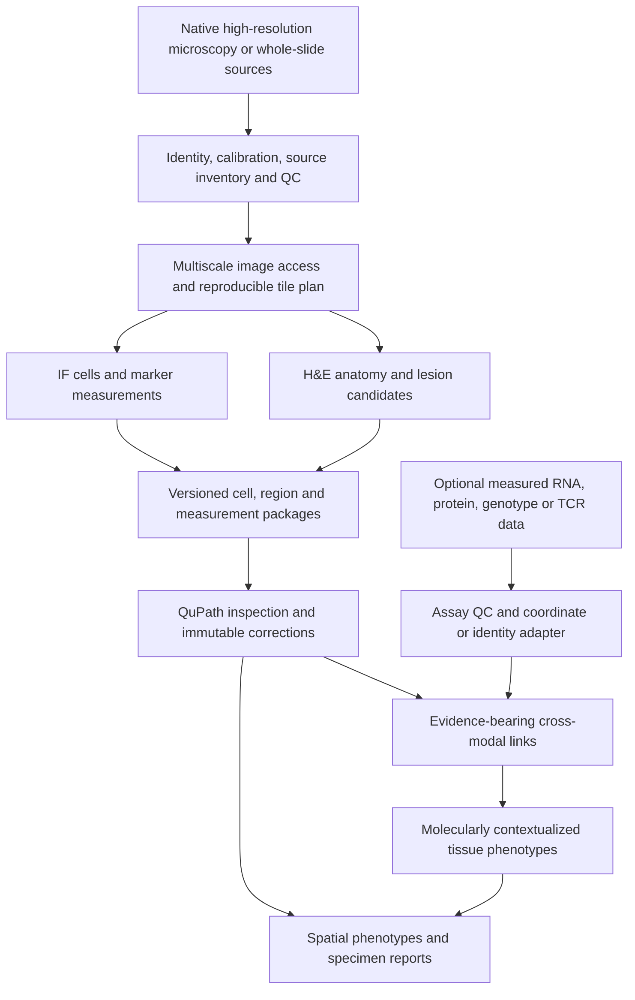

# IFQuant Platform development roadmap

> The repository-status table below is the **pre-implementation audit** preserved
> with the original methodology research. Its statements that H&E, CI, licensing
> and spatial adapters are absent have been superseded. Current execution order:
> [active plan](../docs/DEVELOPMENT_PLAN.md); current evidence: [PROGRESS](../PROGRESS.md).

**Date:** 2026-10-09
**Status:** draft proposal; implementation and scientific claims are unchanged
**Inspected baseline:** `fad4c18`, branch `codex/phase5-stardist`

## Summary

Develop IFQuant Platform as a **high-resolution tissue imaging and spatial phenotyping tool**, starting with lung injury and regeneration. Make calibrated image analysis and H&E morphology the usable core; add molecular context through optional adapters. Tumor microenvironment analysis is a later application of the same infrastructure. This is a proposed working identity, not a repository rename or a settled product commitment.

The intended inputs include future user-obtained microscopy and whole-slide images. Public datasets support development, benchmarking, and demonstrations; their limited image resolution, annotations, or availability do not define the product's scope. Lack of private validation data should leave specific accuracy claims open while allowing engineering, review workflows, and interoperability to progress.

The strongest first complete workflow is: **high-resolution image intake -> tissue and artifact QC -> cells and anatomical regions -> H&E lesion-context measurements -> review -> reproducible specimen report**, with an optional branch that relates those regions to measured spatial RNA or protein data. An additional model should earn its place by improving a defined task over an interpretable baseline.

## Details

### Current repository status

The working tree was clean before this report. The latest local commit is dated 2026-08-31; the status below describes this checkout, not an independently fetched remote.

| Area | Confirmed implementation or recorded evidence | Remaining work |
| --- | --- | --- |
| Package and contracts | Python package, canonical JSON and hashes, image/channel/method/cell-object contracts, validators and CLI exist. | Broaden modalities through versioned contracts without weakening existing v1 validation. |
| Native QuPath | Recorded full-frame DAPI pilot: 1,803 candidates, 1,700 exported objects, 103 boundary exclusions. | Formal H1 review and H2 disposition for 194 accepted objects with topology warnings remain open. |
| StarDist | Adapter binds extension, weights, preprocessing and runtime identities; inference reached. | Fresh execution must exercise the staged QC-only 0.001-pixel geometry repair and produce a valid export and QC package. Runs 06-09 remain diagnostic/failed evidence. |
| InstanSeg | Backend descriptor exists. | Executor explicitly rejects this unimplemented backend. Implement only after the shared export boundary is stable. |
| Dataset governance | Observation lineage, reviewed-reference contracts, group-aware splits and held-out locks exist. | Real/reference-dataset intake, source identity mapping and scientific eligibility are unresolved. |
| Segmentation evaluation | Independent raster verification, detection, split/merge, boundary, count and measurement-bias evaluation exist. | A scored real baseline with suitable annotations and prospective criteria is absent. Synthetic success is not an accuracy result. |
| H&E | No H&E implementation found in this checkout. The executor explicitly rejects brightfield. | A separate brightfield executor, tissue/region contracts, anatomy, lesion candidates and review/reporting. |
| High-resolution execution | QuPath is the image execution layer, but the demonstrated scope is one 2048 x 2048 singleton-Z/T fluorescence image. | Whole-slide scale tests, tile ownership/overlap, bounded memory, resumability and multi-file source accounting. |
| Spatial phenotypes and omics | No omics adapter or spatial-phenotype analysis module found. | Coordinate transforms, region/spot/cell relationships, spatial statistics and optional molecular-data adapters. |
| Release engineering | Tests and package metadata exist. No tracked CI workflow, dependency lock or root license was found. | Reproducible environments, CI, licensing decision, example data recipes and a complete documented run. |

Primary repository evidence: [README](../README.md), [Phase 1 QC](../validation/PHASE1_QC_STATUS.md), [Phase 3](../docs/PHASE3_WIP_STATUS.md), [Phase 4](../docs/PHASE4_STATUS.md), [Phase 5](../docs/PHASE5_STATUS.md), [QuPath boundary](../qupath/README.md), [CLI](../src/ifquant_platform/cli.py), [observation schema](../contracts/governed-observation-set.schema.json).

**Fresh verification:** 112 tests and 130 subtests passed in 42.51 seconds using the existing Python 3.12 environment. An initial run encountered sandbox temporary-directory permission errors; a write/read/delete probe succeeded in the workspace, and redirecting `TEMP`/`TMP` there resolved the test failures without code changes. The local log is [pytest.log](../validation/output/audit-20261009/pytest.log), which is Git-ignored. No QuPath runtime replay, model benchmark or private-image analysis was performed for this assessment.

One schema change matters for future portability: governed observations require a nonempty `mouse_id`. Human datasets must not be inserted using fictional mouse IDs. A future version should describe species and subject identity explicitly, preserving v1 compatibility and grouping by the actual biological unit.

### What to carry forward from IFQuant Lung

The historical [H&E pipeline](../../IFQuant-Lung/docs/HE_BRIGHTFIELD_PIPELINE.md) and [feature roadmap](../../IFQuant-Lung/docs/HE_BRIGHTFIELD_FEATURE_ROADMAP.md) record approved H0-H3 image/identity/stain/denominator work for one four-mouse, eight-section cohort. H4 anatomy remains developmental; H5-H6 lesion generation and anatomical authorization are unavailable; H7-H8 review parsing and ordinal aggregation are engineered but await complete biological review.

Reuse the **definitions and workflow requirements**: separate tissue envelope from tissue material and airspace; retain artifact exclusions; bind stain profiles; preserve blinded review; distinguish section observations from biological replicates. Adapt reusable code only after dependency and contract review. Keep old cohort paths, approvals and outputs historical. A future import adapter can verify their hashes if those data become relevant, but completing that old cohort is not a prerequisite for developing a general tool.

### Product scope decision

| Possible identity | What it delivers | Recommendation |
| --- | --- | --- |
| Imaging assistant | Viewing, segmentation, calibrated measurements, QC and annotation assistance. | Essential foundation, but leaves much of the intended lesion context unfinished. |
| Tissue phenotyping with histopathology review | Imaging plus anatomy, lesion burden, cell neighborhoods, reviewable severity context and specimen reports. | **Recommended first complete product scope.** Lung injury/regeneration is its first application. |
| Multimodal spatial phenotyping | Tissue phenotypes linked to measured RNA/protein and, where supplied, genotype/TCR data. | Design interfaces now; implement optional modules after the image workflow is useful. |

Histopathology support should include expert examination and correction. Autonomous diagnosis, a universal injury grade and a universal cross-species classifier are separate claims requiring evidence that this repository does not currently have.

### Papers and methods to incorporate

Priorities describe the proposed development sequence: **core** means directly useful to the first product; **next** adds spatial or molecular context; **conditional** needs a particular dataset or a demonstrated baseline limitation. These are integration recommendations, not claims that the methods already work on the intended future images.

#### Lung morphology and lesion context

| Reference or method | Useful contribution | Proposed use and limit |
| --- | --- | --- |
| **LungDamage / Liberti et al., Cell Reports, 2021** — [paper](https://pmc.ncbi.nlm.nih.gov/articles/PMC8220578/), [code](https://github.com/WALIII/LungDamage) | H&E color clustering and spatial injury mapping in a lung-regeneration study. | **Core baseline.** Adapt candidate maps, then validate against reviewed regions. Cluster rank does not independently establish pathology severity. |
| **Hsia et al., ATS/ERS lung-structure standards, 2010** — [statement](https://pmc.ncbi.nlm.nih.gov/articles/PMC5455840/) | Reference spaces, sampling and stereological interpretation. | **Core measurement design.** Keep 2D airspace profiles distinct from claims about alveolar number or 3D volume. Record preparation and sampling metadata. |
| **ATS experimental acute lung injury update, 2022** — [report](https://pmc.ncbi.nlm.nih.gov/articles/PMC8845128/) | Defines injury evidence across histological and other biological domains. | **Core rubric reference.** H&E morphology is one component of injury assessment; choose a disease/model-specific rubric rather than importing a universal score. |
| **Predella et al., standardized digital histological evaluation, 2023** — [paper](https://pmc.ncbi.nlm.nih.gov/articles/PMC10633836/) | Reproducible digital ROI sampling and assisted lung-injury scoring using QuPath/Fiji. | **Core review workflow.** Useful for field selection, reviewer forms and repeatability. Does not provide an autonomous severity model. |
| **QuPath stain separation and pixel classification** — [stains](https://qupath.readthedocs.io/en/stable/docs/tutorials/separating_stains.html), [classification](https://qupath.readthedocs.io/en/stable/docs/tutorials/pixel_classification.html) | H&E preprocessing and interactive color/texture classification. | **Core comparator.** Compare a compact supervised classifier with LungDamage-style clustering. Stain-separated intensity is not automatically a concentration measurement. |

#### Image execution and representation

| Reference or method | Useful contribution | Proposed use and limit |
| --- | --- | --- |
| **InstanSeg, Goldsborough et al.** — [2024 method preprint](https://arxiv.org/abs/2408.15954), [official implementation](https://github.com/instanseg/instanseg) | Portable cell/nucleus segmentation with separate brightfield and fluorescence use cases. | **Core candidate after StarDist stability.** Bind the correct model and resolution for each modality; evaluate nuclear and whole-cell tasks separately. |
| **Mesmer / TissueNet, Greenwald et al., Nature Biotechnology, 2022** — [paper](https://www.nature.com/articles/s41587-021-01094-0) | Annotated multiplexed tissue images and a whole-cell segmentation method. | **Core benchmark resource; conditional extra backend.** Useful for fluorescence evaluation. Nuclear and cell labels are not interchangeable, and dataset/model terms require review. |
| **MCMICRO, Schapiro et al., Nature Methods, 2022** — [paper](https://www.nature.com/articles/s41592-021-01308-y), [project](https://mcmicro.org/) | Modular processing of multiplexed tissue images into single-cell data. | **Core architectural reference.** Import compatible upstream results or reuse modules; avoid rebuilding acquisition-specific preprocessing without a need. |
| **OME-Zarr / OME-NGFF** — [format paper](https://pmc.ncbi.nlm.nih.gov/articles/PMC9980008/) | Chunked, multiscale access to large microscopy data. | **Core storage option.** Preserve native sources and support lazy pyramidal reads; conversion should be optional and traced to the source. |
| **UNI, Chen et al., Nature Medicine, 2024** — [paper](https://www.nature.com/articles/s41591-024-02857-3) | Pretrained H&E representations for downstream tasks. | **Conditional.** Test frozen embeddings with a small classifier only after color/texture baselines. Human pathology pretraining does not establish mouse injury validity. |

#### Spatial and molecular analysis

| Reference or method | Useful contribution | Proposed use and limit |
| --- | --- | --- |
| **SpatialData, Marconato et al., online 2024 / issue 2025** — [paper](https://www.nature.com/articles/s41592-024-02212-x), [docs](https://spatialdata.scverse.org/en/stable/) | Images, labels, points, shapes, tables and coordinate transforms in a spatial data framework. | **Core interface design; next adapter.** Use it for interoperability while IFQuant contracts retain QC, meaning and provenance. |
| **Squidpy, Palla et al., Nature Methods, 2022** — [paper](https://www.nature.com/articles/s41592-021-01358-2) | Spatial graphs, neighborhood enrichment, co-occurrence and image-associated omics analysis. | **Next; useful before omics.** Apply to validated IF cell phenotypes and regional labels. Condition null models on tissue structure and specimen. |
| **VALIS, Gatenbee et al., Nature Communications, 2023** — [paper](https://www.nature.com/articles/s41467-023-40218-9) | Registration of brightfield and fluorescence whole-slide image series. | **Next when pairing exists.** Store transforms and landmark errors; neighboring sections do not guarantee the same individual cells. |
| **cell2location, Kleshchevnikov et al., Nature Biotechnology, 2022** — [paper](https://www.nature.com/articles/s41587-021-01139-4) | Reference-based estimation of cell-type abundance in spatial transcriptomic locations. | **Next for mixed-cell spots.** Requires an appropriate single-cell reference; retain uncertainty and unknown populations. Not necessary for every single-cell spatial assay. |
| **Tangram, Biancalani et al., Nature Methods, 2021** — [paper](https://www.nature.com/articles/s41592-021-01264-7) | Alignment of single-cell expression with spatial expression data. | **Conditional alternative.** Evaluate mapping on held-out genes and locations. Nonspatial scRNA-seq plus H&E alone does not establish measured cell coordinates. |
| **BANKSY, Singhal et al., Nature Genetics, 2024** — [paper](https://www.nature.com/articles/s41588-024-01664-3) | Neighborhood-aware cell typing and tissue-domain identification. | **Next after a simple neighborhood baseline.** Useful for candidate inflammatory or regenerative niches; clusters require biological interpretation. |
| **LIANA+, Dimitrov et al., Nature Cell Biology, 2024** — [paper](https://www.nature.com/articles/s41556-024-01469-w) | Framework for cell-cell communication inference using molecular data. | **Conditional.** Report spatially supported interaction hypotheses, not demonstrated signaling or TCR antigen recognition. |
| **SpatialGlue, Long et al., Nature Methods, 2024** — [paper](https://doi.org/10.1038/s41592-024-02316-4) | Spatial-domain discovery by integrating multiple molecular modalities. | **Conditional on compatible paired spatial modalities.** Not the default for unrelated RNA and image datasets; registration and missingness precede integration. |

#### Reference applications and reusable data

| Reference | Why it matters | Proposed role |
| --- | --- | --- |
| **Nagler, Sud, Ghannam et al., Slide-GoTags, Nature Biotechnology, 2026** — [supplied paper](https://www.nature.com/articles/s41587-026-03194-1), [code](https://github.com/amitsud/Slide-GoTags) | Combines spatial nuclei, RNA, targeted transcript genotypes and TCRs to study tumor-immune organization. | **Conditional TME application.** Import processed modalities and reproduce a narrow spatial analysis before considering raw-sequencing support. |
| **Russell et al., Slide-tags, Nature, 2024** — [paper](https://www.nature.com/articles/s41586-023-06837-4) | Spatial barcode assignment to nuclei in intact tissue sections. | Understand the acquisition and localization evidence underlying Slide-GoTags; this is an assay, not an image-only plugin. |
| **Kasmani et al., influenza lung spatial atlas, Nature Communications, 2023** — [paper](https://www.nature.com/articles/s41467-023-42021-y), [code](https://github.com/ryanjbrown21/Flu_Spatial_Sequencing) | Histology-associated spatial expression and companion scRNA-seq across age and infection time. | **Preferred lung integration example.** Useful for tissue/RNA association; not automatically a lesion-severity ground-truth dataset. |
| **Niethamer et al., longitudinal post-viral lung regeneration atlas, Cell Stem Cell, 2025** — [paper](https://doi.org/10.1016/j.stem.2024.12.002), [GSE262927](https://www.ncbi.nlm.nih.gov/geo/query/acc.cgi?acc=GSE262927) | Single-cell reference for transient and persistent injury-associated states during lung regeneration. | **Next biological reference.** Inform cell-state vocabularies and gene programs; this nonspatial reference does not locate those states in a future image or demonstrate lineage from morphology. |
| **HEST-1k, Jaume et al., NeurIPS, 2024** — [paper](https://arxiv.org/abs/2406.16192), [project](https://github.com/mahmoodlab/HEST) | Histology/spatial-transcriptomics data, processing tools and prediction benchmarks. | **Conditional benchmark adapter.** Select a small relevant subset and audit study overlap; inferred expression remains a prediction. |
| **Schürch et al., Cell, 2020** — [paper](https://pmc.ncbi.nlm.nih.gov/articles/PMC7479520/) | Multiplexed-protein cellular neighborhoods at the colorectal tumor invasive front. | **Optional TME bridge before genotype/TCR complexity.** Demonstrates the value of spatial phenotypes using imaging-derived cell data. |

### Lessons from the supplied Slide GoTags paper

The supplied 34-page PDF was read as source material, including its workflow figure and methods. The publisher gives 22 July 2026 as publication date. Its key software lesson is to associate several separately measured observations with one nucleus and a spatial location, preserving missingness and modality-specific QC.

For a future adapter, represent a nucleus ID and location, RNA counts and cell-state annotations, TCR chains/clonotype, targeted variant calls, assay metadata and the relevant specimen. Missing genotyping or TCR coverage must remain missing; it cannot become wild type or absence of a clone. The paper discusses transcript-abundance and positional capture biases, allele dropout and differences between RNA-derived genotype frequencies and DNA measurements (PDF page 10).

The molecular modalities derive from the same tissue slice, but the example H&E image is explicitly a **serial section** (Fig. 1, PDF page 3). The platform must therefore distinguish shared molecular barcodes from image registration and anatomical correspondence. Its variant-selection workflow also uses prior tumor/germline exome and RNA data (page 15); a future raw-assay implementation would require substantially more than H&E and ordinary gene counts.

An achievable computational demonstration is to import the processed nucleus coordinates, expression, clonotypes and genotypes, then reproduce a declared neighborhood/proximity result. The paper uses normalized mixing scores and permutation tests (page 17). A platform extension should also test tissue-conditioned nulls and account for multiple comparisons. Colocalization can support a candidate interaction; it does not by itself prove antigen presentation, TCR specificity or functional killing.

The reported deposits are **SCP3655** (MC38-SIINFEKL), **SCP3657** and **SCP3660** (mouse checkpoint-blockade experiments), and **SCP3667** (human tumors); code is in the [authors' repository](https://github.com/amitsud/Slide-GoTags). These are identified resources, not downloaded or validated inputs in this assessment.

### H&E lesion severity should be an evidence-backed profile

Build anatomy and artifact context before interpreting local color or density. A dark region can be dense injury, normal airway, vessel, fold or staining variation. The initial anatomy vocabulary should include alveolar parenchyma, airway, vessel, pleura and unresolved. Pathology labels should retain uncertainty and reviewer provenance.

| Output | Required definition and evidence |
| --- | --- |
| Dense/consolidated lesion fraction | Reviewed lesion area divided by a named, eligible reference area. Store numerator and denominator as calibrated areas. |
| Airspace profile fraction | Airspace area within an alveolar reference region that includes relevant tissue and airspace. Never use a tissue-material-only mask as this denominator. |
| Cellularity | Accepted nuclear count per eligible tissue area, with compartment and detection-QC context. It does not establish immune lineage. |
| Peribronchial/perivascular cuff burden | Reviewed cuff area and the corresponding anatomical boundary length; also expose both raw components. |
| Septal or epithelial morphology | Explicitly defined 2D measurements, acquisition/preparation context and exclusion rules. Defer 3D interpretations to an appropriate sampling design. |
| Ordinal severity | Named, versioned, disease-specific rubric with a blinded or explicitly prediction-exposed reviewer record. Keep components and uncertainty visible. |

Do not manufacture one weighted severity number by combining color clusters, density and airspace loss. If a later endpoint needs a composite, prespecify and validate its weights and interpretation. Preserve the historical rubric as one study profile, not the universal default. Inflammation, acute damage, fibrosis and regeneration need distinguishable endpoint definitions.

For LungDamage, create a versioned adaptation with upstream attribution. The current [reference demo](https://github.com/WALIII/LungDamage/blob/master/DL_demo_ref.m) uses `sum(find(class_mask))`, which sums index positions instead of pixel counts. Its reference mode also clusters concatenated reference and target images, making classifications dependent on the other images in the run. Correct counting, freeze development-fitted centers and reviewed class mappings, fix random seeds, express scale in physical units, and process only eligible reference space. These changes define a new method instance; they are not an assertion of equivalence with the published code.

Keep two comparisons initially: the adapted unsupervised baseline and a compact supervised QuPath color/texture classifier. Introduce UNI embeddings or a deep lesion model only if reviewed data demonstrate a specific unresolved failure. If no appropriate public lesion masks or future expert references are available, release the candidate/review workflow with accuracy marked unevaluated; do not score predictions against themselves.

### High resolution and multimodal architecture

Proposed boundaries:

- **Sources and scale:** preserve originals, including all members of multi-file acquisitions such as VSI/ETS. Record series, channel/axis order, physical pixel sizes and reader versions. Use pyramidal TIFF/native readers or OME-Zarr with lazy access; avoid loading a whole WSI into RAM or requiring a full conversion for every run.
- **Tiling:** bind level, physical resolution, overlap/halo and processing ownership. Deduplicate cell objects and reconcile region areas across seams. Every tile retains its full-resolution transform. Low-resolution previews cannot silently become inputs for high-resolution endpoints.
- **Execution:** use separate IF and H&E configurations with shared provenance utilities. Maintain explicit 2D plane selection; broader 3D/time-series analysis is a later capability. Record memory, throughput, failures, cancellation and resume behavior.
- **Packages:** add region/mask, spatial-transform, assay-observation and phenotype-summary contracts. Large masks, label images and sparse matrices can be hashed sidecars rather than JSON arrays. Preserve cell, nucleus, region, spot and specimen identity as different entity types.
- **Interoperability:** expose SpatialData/AnnData adapters. Distinguish an exact shared barcode, a measured transform, an uncertain registration, a modeled assignment and a specimen-level association. No cross-modal join should imply a stronger relationship than its evidence.
- **Optional dependencies:** keep the lightweight validation core installable independently of segmentation, WSI and omics environments. Pin supported runtime/model combinations and record code, weight and data licenses separately.

Potential later modules are `imaging`, `histology`, `spatial`, `omics`, `reporting` and `benchmarks` beneath the existing Python package, with narrow corresponding QuPath exporters. These names describe proposed responsibility boundaries; no such modules were created in this assessment.

Useful phenotype outputs should remain interpretable at the region and specimen levels: an alveolar region's lesion fraction and measured epithelial-marker composition; an airway's cuff burden and neighboring cell phenotypes; or a lesion region's associated measured RNA programs. A later TME report can add distances and enrichment between variant-expressing tumor nuclei and particular TCR clonotypes. Each result should show whether its identity came from measured markers, model prediction, expert annotation or a molecular assay. Expression similarity or morphology alone cannot establish lineage or a regenerative fate.

### Development evidence with currently accessible data

| Resource | What it can exercise | What remains to verify |
| --- | --- | --- |
| TissueNet/Mesmer resources | Fluorescence nucleus/cell import, instance evaluation and compartment handling. | Exact channel/label definitions, resolution, grouping metadata, license and possible pretrained-model overlap. This is not lung-lesion validation. |
| LungDamage example images | Baseline-port smoke tests, overlays and class-count reconciliation. | Examples do not establish reviewed lesion labels or WSI-scale behavior. |
| Kasmani influenza atlas: GSE202322 spatial and GSE202325 scRNA-seq | H&E/spatial overlays, reference-based composition and lung-state context. | Actual file retrieval, specimen matching, native image resolution and annotation availability. A GEO sample record lists a `tissue_hires_image.png`, which is a spatial-analysis image and must not be assumed to be the native scanner WSI. |
| Niethamer regeneration atlas: GSE262927 | Reference cell-state annotations and regeneration-associated gene programs. | State-label compatibility, specimen/condition identities and cross-study transfer. It supplies no measured spatial positions for an unrelated image. |
| HEST selected samples | Histology/spatial-expression import and held-out cross-modal benchmarks. | Download access/terms, source-patient identifiers, full-resolution availability and duplicated studies. Avoid downloading the entire collection by default. |
| Schürch CODEX resource | Imaging-based cell neighborhoods and an optional TME demonstration. | Accessible image/table versions and patient/region mapping. |
| Slide-GoTags deposits | Processed multimodal nucleus joins and proximity statistics. | File-level access, barcode coverage, coordinate definitions, genotype/TCR missingness and image correspondence. |
| Future user images | Intended high-resolution lung morphology and phenotype workflows. | Prospective acquisition-specific accuracy, suitable references and endpoint acceptance. |

Source links: [TissueNet paper](https://www.nature.com/articles/s41587-021-01094-0), [LungDamage](https://github.com/WALIII/LungDamage), [influenza atlas data statement](https://www.nature.com/articles/s41467-023-42021-y), [example GEO image listing](https://www.ncbi.nlm.nih.gov/geo/query/acc.cgi?acc=GSM6108346), [HEST](https://github.com/mahmoodlab/HEST), [CODEX study](https://pmc.ncbi.nlm.nih.gov/articles/PMC7479520/), [Slide-GoTags deposits](https://www.nature.com/articles/s41587-026-03194-1).

Public resource discovery is not a completed intake audit. No full dataset or model was downloaded here, and the search did not establish an immediately usable expert-labeled mouse lung lesion-severity benchmark. Availability of expression data, figures or downsampled histology does not fill that gap. Use synthetic fixtures for numerical and scale behavior, public annotated data for the tasks they actually label, and future images for the intended acquisition domain.

### Roadmap and exit evidence

These work packages extend the existing plan; they do not silently close or renumber its scientific gates. Engineering and interoperability may advance while an endpoint's scientific status remains unevaluated.

| Work package | Concrete deliverables | Exit evidence |
| --- | --- | --- |
| **WP0 Restore a reproducible core** | Document the tested environment; add CI and an environment lock; resolve licensing; fresh StarDist smoke/export; preserve failed-run lineage. | Reproducible tests, independently valid native and StarDist packages, inspectable QC and explicit outstanding review status. If the historical image cannot be used, create a new suitable benchmark run rather than fabricating equivalence. |
| **WP1 Establish high-resolution intake** | Versioned subject/source-set contracts; modality and series selection; calibration; lazy pyramid reader; tile plan; seam policy; resume/cancel ledger. | Tile/full-image numerical agreement on manageable fixtures; no seam double-counting; bounded-memory large-image tests; clear missing-file/calibration failures. Publish measured limits for tested hardware. |
| **WP2 Deliver the H&E module** | Brightfield exporter; stain profile; tissue, airspace and artifact masks; anatomy/unresolved regions; adapted LungDamage and compact QuPath baseline; correction import. | Numerator/denominator reconciliation, reproducible overlays, immutable review round trip, meaningful negative tests and accuracy results only where suitable labels exist. |
| **WP3 Finish the usable imaging product** | Cell and region features, marker phenotypes, candidate lesion profiles, optional ordinal forms, spatial neighborhoods, section/specimen summaries and a complete example report. | A user can complete one end-to-end run without editing source code; reports retain failures, uncertainty, method identity and denominator/review scope. This is the first release candidate. |
| **WP4 Add spatial RNA context** | SpatialData/AnnData import/export; histology-to-spot linkage; cell2location where appropriate; simple neighborhood analysis followed by BANKSY if useful. | Coordinate round-trip checks; exact spot/barcode joins; no invented cell assignments; reproduced public example with provenance and leakage controls. |
| **WP5 Add optional multimodal/TME applications** | Registration adapter; processed Slide-GoTags adapter; genotype/TCR-aware neighborhood reports; optional LIANA+ or SpatialGlue when inputs support them. | Reproduce a narrowly specified source analysis, retain missingness, compare to a suitable null and test sensitivity to registration/annotation uncertainty. |
| **WP6 Establish future intended-use performance** | Acquire relevant high-resolution images and independent references; freeze study-specific splits/endpoints; run external acquisition-domain evaluation. | Approved prospective accuracy, bias, uncertainty, repeatability and failure criteria for that use. This remains data-dependent and is not required to demonstrate the software architecture. |

WP0 and the design work in WP1 come first. H&E engineering can then progress alongside core segmentation stabilization. WP3 is a complete imaging/histopathology-support product; WP4-WP5 are optional extensions, not mandatory dependencies for ordinary image analysis. Start omics with processed data adapters. Raw sequencing orchestration, large-scale model training, 3D reconstruction and histology-to-transcriptome prediction should remain later projects with separate justification.

### What to measure during development

- **Execution:** peak memory, elapsed time, image area processed, tile throughput, cancellation/resume correctness and failed-unit accounting. Synthetic scale tests exercise infrastructure, not optical fidelity.
- **Segmentation:** object precision/recall, split/merge rates, boundary error, size/crowding strata, count bias and downstream measurement bias, using the existing evaluator where its contract fits.
- **Lesions and severity:** per-class overlap and area bias where reference masks exist; ordinal agreement where independent reviewer labels exist; abstention coverage and compartment-specific failure modes. Stable colors alone are not accuracy evidence.
- **Spatial joins:** calibration/transform round trips, landmark error in micrometers, cell/spot/region reconciliation and sensitivity of endpoints to registration error.
- **Molecular integration:** evaluate held-out genes or independent protein/annotation evidence where available, compare reference-mapping alternatives and preserve uncertainty. Agreement with labels derived from the same input features is not independent validation.
- **Biological comparisons:** keep mouse/patient/study groups separate; never treat tiles, cells or adjacent sections as independent biological replicates. For fractions, pool eligible raw components only under a declared sampling/aggregation rule; preserve ordinal components rather than inventing averages.
- **Model comparisons:** freeze preprocessing and test partitions, audit public-data/pretrained-model overlap, compare against simple baselines and report calibration/coverage where probabilities are used. No numeric scientific pass threshold is invented from the available unlabeled material.

## Updated execution and next steps

The user authorized implementation through all current priorities 1–5. The [31-job register](../docs/DEVELOPMENT_PLAN.md) and [execution report](../docs/EXECUTION_REPORT.md) now supersede this note's original start-up order. Native interchange, the real lung replay, imaging qualification tools and optional molecular/statistical boundaries execute. Three conditional method branches remain explicitly unimplemented; several implemented tools still need scientific reference data.

1. Obtain representative future high-resolution images and independent pathology/cell references under the frozen sampling protocol. Review native/StarDist warnings and score the trained QuPath comparison before adding another unscored segmentation engine.
2. Curate source-bound lung programs and broad-feature inputs with independently verified biological units. The five-gene Kasmani panel is an interchange example, not evidence for biological domains or deconvolution.
3. Execute registration on actual paired images with held-out landmarks. Obtain processed Slide-GoTags cells through supported authenticated access and select a narrow cell-level reproduction. Current public source evidence reconciles 240 reported rows, not cell-level spatial inference.
4. Activate cell2location/Tangram, BANKSY, InstanSeg, LIANA+, SpatialGlue, CODEX, UNI or HEST only when a compatible input/question/reference supports a meaningful comparison. Those references are mapped to jobs in the register.
5. Evaluate intended-use accuracy, sampling bias and acquisition-domain robustness as WP6. Independent image analysis remains a complete product branch while omics/TME extensions are optional.

Revisions include explicit TIFF pyramid-array selection, partial-download detection, bounded NGFF/cell-feature bridges, calibrated 2D cuff/transect semantics, explicit RNA normalization, specimen-level association, conditioned finite-sample nulls and abstention for unsupported calls. The [execution report](../docs/EXECUTION_REPORT.md) gives the evidence and rationale. No biological validity, expert acceptance or universal severity score is inferred from software tests.
